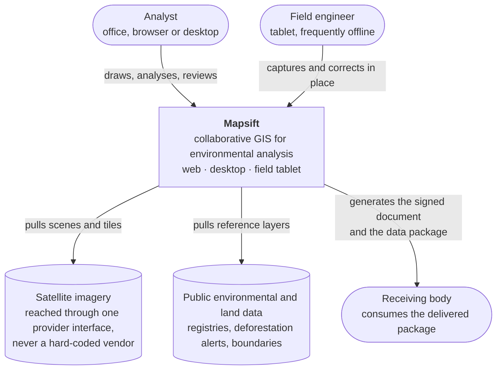
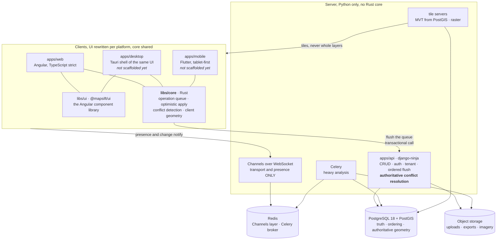
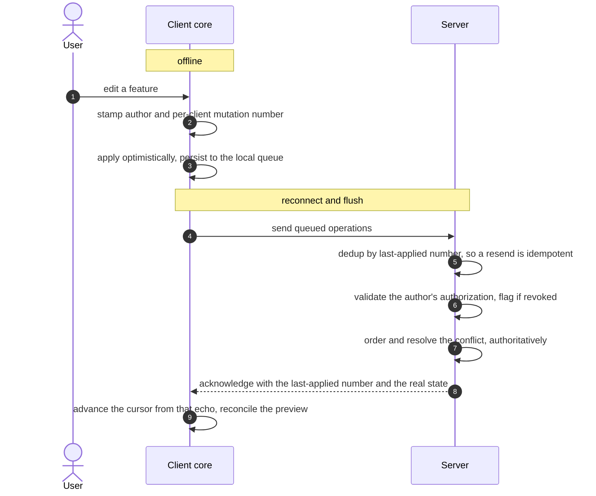
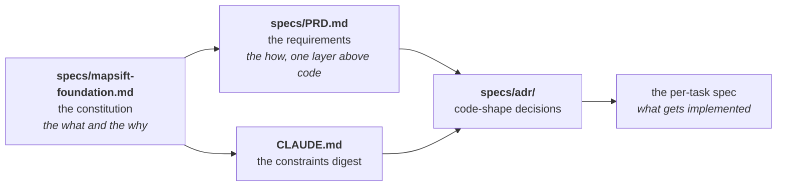

<!-- Logo goes here when it exists: 

 -->

<h1 align="center">Mapsift</h1>

  <strong>Several people on one map, in real time, and it keeps working when the signal drops.</strong>

  
  
  
  
  
  
  

> [!WARNING]
> Mapsift is **pre-implementation**. There is no application code yet, on purpose. What exists is the
> constitution, the requirements, and the architecture decisions, all closed and written down, plus one risk
> spike that has already run and returned numbers. This README describes the product being built and the
> shape it is being built into, not a finished tool. Sections marked **pending** land with the scaffold.

 

## The problem

Environmental and land analysis is stuck between two bad options.

On one side there is desktop GIS: powerful, precise, works offline, and single-user by nature. Collaborating
means emailing files around, versions drift, and two people cannot work the same map at the same time.

On the other side there are collaborative web mapping tools: real-time, pretty, and generic. They do not speak
the language of vegetation cover, preservation areas, or georeferenced parcels, edits do not flow back to the
source, and they stop working the moment the connection drops.

So an environmental team either works alone in desktop GIS and reconciles by hand, or pays for a cloud tool
that does not know their domain and dies in the field. The engineer is out there under the sun, and the field
has no wifi.

 

## What Mapsift is

A collaborative, multi-platform GIS for environmental analysis, with general-purpose technical depth.

Several people edit the same map in real time. The work continues offline and merges on reconnect without
trampling anyone. The technical depth is at the level of professional desktop GIS in what it covers, and the
environmental and land workflow is the anchor domain that guides packaging and the first users, never a
ceiling on capability.

Three surfaces, one product: a **web app**, a **desktop app** (Tauri), and a **mobile app** (Flutter,
tablet-first for the field). The interface is rewritten per platform. The logic core is not.

**The one design rule the product is measured against:** when a feature is designed, the question is not
whether it has the capability, it is whether the professional gets the full power without the beginner
drowning in it. Depth exists; the surface decides how much of it lands on you before you ask.

 

## The one idea everything derives from

**Server-authoritative with offline support.** Get this wrong and nothing else makes sense.

PostgreSQL holds the truth and defines the order of operations. Each client keeps a working copy and a
persistent local operation queue, so an edit commits locally before any network call and survives an app
restart. On reconnect the client flushes and the server orders, resolves, and answers.

Offline is a fully usable degraded mode, not the resting state. "Local-first" is a **sensation Mapsift
delivers** (your work continues), not an architecture that makes the client the truth. Peer-to-peer and
server-less operation are explicitly off the table, and CRDTs are a gated candidate rather than the default.

 

## The moral line

Some geometry carries legal weight: a preservation area boundary, a legal reserve, a georeferenced registry
parcel. An error there is not cosmetic, it is a compliance event.

So the rule that outranks convenience: **a conflict on legal-weight geometry is detected, both versions are
preserved, and a human decides.** Never a silent overwrite, never a silent discard, never a feature that
vanishes or resurrects without a record. The system also refuses to invent a merged geometry that neither
person drew, because for a legal boundary that is a hazard dressed as a convenience.

Cheap conflicts stay cheap. Different features never collide, different properties of one feature never
collide, and a styling change resolves last-writer-wins without bothering anyone. The expensive case is the
one that gets the human.

Five behaviours are rejected outright as a consequence, and each is common enough in this market to be worth
naming so nobody reintroduces one by habit: no silently discarded style override, no estimate where an exact
figure is expected, no nightly recompute of a metric that carries weight, complex geometry that is creatable
from scratch rather than only editable, and permanent history for legal weight instead of a session-only undo
stack.

 

## Architecture

### System context

### The containers

One Rust source compiles to **WASM** for web and desktop and to a **native FFI library** for mobile. The
server carries no Rust at all: its authoritative geometry runs in PostGIS.

### How one edit travels

### Why it is shaped this way

**Elements versus layers is the frontier, and it is what protects performance.** Elements are what a human
draws and edits: light, live, offline-capable, behind the operation queue. Layers are what is imported or
derived: rasters, imagery, large vector, analysis output, heavy, server-authoritative, and served as tiles
that are never loaded whole into the client. Keep the light thing live and the heavy thing tiled, and the
client stops being the bottleneck.

**The renderer is MapLibre over WebGL, which brings an editing restriction.** MapLibre renders; it does not
edit. Interactive geometry editing keeps the features under live edit in a client-side source that gets
reprocessed on every change, so the editable working set is capped by a measured budget and a whole layer is
never promoted into live editing.

**The conflict rule exists twice, deliberately.** One specification, implemented in the Rust core and again in
Python on the server, kept identical by golden tests in CI. Resolution authority is the server's alone and the
client's answer is an optimistic preview. This is not duplication to be refactored away: putting Rust on the
server was considered and rejected, because it solves the harmless skew (two runtimes disagreeing at one
instant) and does nothing about the dangerous one (an old client carrying a stale core meeting a newer server).

**Ordering lives in the database.** The flush is a transactional call that PostgreSQL orders through a
per-project version allocated inside the transaction, so version order is commit order by construction. The
WebSocket tier carries transport and presence and is never trusted for correctness.

**Everything is a named capability.** Data operations are named, asynchronous, and exchange serializable data
with no live references crossing the boundary. The app is the first consumer of its own public capability
layer, and extensions, the SDK, and the AI agent are further consumers of the same one. That single discipline
is what keeps portability and sandboxing possible later without a rewrite.

 

## The repository

Organised by **unit of deploy, not by layer**.

| Path | What it is | Why it exists there |
|---|---|---|
| `apps/api` | The one Django backend | Truth, auth, tenant isolation, background jobs, ordering, and the authoritative conflict resolution |
| `apps/web` | The Angular web client | The full native capability floor with no install; consumes the core as WASM |
| `libs/core` | The shared Rust client core | Operation queue, optimistic apply, optimistic conflict detection, client geometry. Compiled to WASM and to FFI. **Runs on clients only** |
| `libs/ui` | `@mapsift/ui`, the component library | 45 primitives consumed by package name, so the product spends its energy on the domain instead of on a combobox |
| `infra/` | Third-party services as compose units | PostgreSQL with PostGIS, Redis, object storage, tile servers. Things we configure, never things we write |
| `specs/` | The authority chain | The constitution, the requirements, the ADRs, the testing method, the dependency survey |
| `justfile` | Top-level orchestration | `just dev`, `just test`, `just lint` across four ecosystems |

**The rule that keeps a future split cheap:** nothing in `apps/` imports from another `apps/`. Everything
shared crosses through `libs/`. A service moves to its own repository by cutting one folder, never by
untangling cross-service imports.

**Four languages, four non-overlapping roles.** Rust is the shared client core. Python is the one backend.
TypeScript is the web and desktop interface. Dart is the mobile interface. Each ecosystem uses its own native
tooling and no single monorepo tool spans them.

**What is deliberately absent, and stays absent until its gate opens:** `apps/sync`, `apps/desktop`,
`apps/mobile`, and any sync internals. Creating one of those early is not neutral. It invites code written
against a guess, and the guess then defends itself.

 

## Gotchas, the ones that actually stop you

Read this section before you write anything. Every item here has already cost someone time, or is documented
to cost the next person time.

**The web app must be zoneless, and this is not a style preference.** The Angular WASM integration path
requires native async and top-level await and **errors out on a Zone.js application**. Turning Zone.js back on
does not degrade the core's integration, it removes it.

**WebGL2 is the floor.** MapLibre v5 dropped WebGL1. A browser below the floor is told so explicitly and never
shown a blank canvas that looks like a bug.

**Row-level security must be ENABLED and FORCED.** A role that owns the table bypasses a policy that is not
forced, and a role holding the bypass privilege defeats it outright. The tile server queries PostGIS directly,
outside the ORM, so it must connect non-privileged and set the tenant on its session. Get this wrong and the
tenant wall is decorative while every test still passes.

**Never compute a metric in degrees, and never hard-code one metric frame.** The frame is chosen by the
metric's purpose: geodesic on the ellipsoid for a generic figure, the local topocentric frame for a certified
rural parcel, an equal-area conic for the environmental area chain. UTM is deliberately excluded as an
authoritative frame for a legal area, because its distortion varies with position inside the zone and the
divergence lands in a legal document.

**A PostgreSQL sequence is not a safe change-feed cursor.** The value is taken before commit, so a transaction
that started later can commit first with a higher number and the reader walks straight past rows that are
committed and durable. Measured here: the naive design lost **53.6% of committed rows** at ten concurrent
writers, with the cursor finishing convinced it had seen everything. The ratified answer is the per-project
version, allocated inside the flush transaction.

**Do not "fix" the conflict rule's duplication.** It is two implementations of one specification, guarded by
golden tests. Generating one from the other would put Rust on the server and reopen a decision that is closed.

**Generate with the CLI, then edit.** A file written from memory reproduces the framework shape of several
versions ago. The current Angular schematic already emits OnPush without mentioning it and has dropped the type
suffix, so hand-writing `changeDetection` breaks the verification rule rather than helping.

**Python is 3.13, not 3.14, and the reason is Celery.** Everything else in the backend accepts 3.14. Celery's
own supported-versions list stops at 3.13 while its release notes claim initial 3.14 support, and that gap is
not where the job queue goes.

**Django is 5.2 LTS, and django-ninja caps at `<6.1`.** The 6 line is not a drop-in: 6.1 is not installable
with the API layer today, and 6.0 reaches end of life a year before the LTS does.

**The three performance budgets are distinct and must never be conflated.** The per-tile render budget lives on
the served path, the editable working-set budget lives on the element path, and the element budget decides
classification at import. Three names, three triggers, and a test that asserts one while claiming another is
worse than no test.

**The prototype in `tests/prototypes/` is a visual reference and nothing else.** Open it to see what the result
must look like, then rebuild by refactoring. Never copy a file, a class, or a structure, and never inherit its
architecture, its storage, or its identity shortcuts.

 

## Environment and requirements

> **Pending.** Concrete commands land with the scaffold. What follows is what the scaffold will require and
> what is already decided about it.

**Container-first.** Every service runs in a container from the first commit, in development as well as in
deployment, and the whole system comes up with one command. The container is the source of truth for
**running**; the host toolchains exist for **authoring**, so your editor, language servers, and formatters
work. Compose files stay on the OCI-standard surface, so a Podman host runs them unchanged.

| What | Version | Note |
|---|---|---|
| Docker or Podman, with compose | current | The only hard host requirement for running |
| Python | **3.13** | Capped by Celery, see the gotcha above |
| uv | 0.12.x | Packaging, locking, and the interpreter itself. Still pre-1.0, so pinned exactly |
| Django | **5.2 LTS** | Security-supported to April 2028, with one planned migration to 6.2 LTS |
| PostgreSQL | **18** + PostGIS | The major is ratified, the minor always runs current |
| Node and the Angular workspace | current | Angular v22 line, zoneless, TypeScript strict |
| Rust with Cargo | current stable | Plus `wasm-pack` for the WASM build |

**Host toolchains, for authoring.** On Fedora, `dnf install` covers Docker or Podman and the Node runtime;
Rust comes from `rustup`; uv installs from its own installer and then manages the Python interpreter itself, so
you do not need a system Python matching the pin. Every version above is surveyed with its date and its
particularity in [`specs/dependencies.md`](specs/dependencies.md), which is the only place a version is
allowed to be asserted from.

 

## Running it

> **Pending, with the shape already decided.** The scaffold creates a development compose file with source
> bind-mounted for hot reload and named volumes for dependency and build artifacts, so a container rebuild does
> not re-download the world. `libs/core` builds in its own stage and produces the WASM artifact that
> `apps/web` consumes, which means building the web client never requires a Rust toolchain on the host.
> Orchestration is a `justfile` across the four ecosystems.

 

## Building for production

> **Pending.** Deployment uses a separate compose file, and the difference between it and development is
> configuration and build target, **never a different architecture**. Configuration comes from the environment
> and never from a checked-in file with real values, and no production credential or production data exists in
> any non-production environment.

 

## How the project evolves

Mapsift is a **closed-scope, non-MVP product**, built point by point to completion. "Ship it sooner" is not an
architectural argument here, and release ordering deliberately lives outside the specs.

### The authority chain

When a derived document and the foundation disagree, **the foundation wins and the derived document is the one
that is wrong**. A derived document asserting a choice the authority left open is drift, and the fix is always
to raise the decision or to loosen the derived document, never to let the derived document quietly decide.

### The rules that keep it honest

**One version per round.** A round of decisions bumps the foundation a version with a dated changelog entry
and leaves prior entries intact. An annotation that changes no decision is a patch, not a round.

**A closed decision triggers a fan-out, not an entry.** When something closes, it propagates in one pass to
every document it touches: the foundation carries it as law, the PRD updates the requirement and its
acceptance, `CLAUDE.md` updates the constraint, the path-scoped rules update the enforceable restatement, and
`specs/log.md` gets one grep-able line. **Closing a decision is not finished until its fan-out is finished.**

**An ADR is superseded, never edited.** A later ADR says what it replaces and why, so the reasoning chain stays
readable years later. Only a correction that does not alter the decision may be edited in place.

**Research is verified before it enters.** A report that self-approves is where to dig. This is not
philosophy: a research round once put a **revoked** legal standard into the requirement that computes legally
consequential area, in six places, and it was caught only because someone graded that round against the
primary source.

### Test-first, in two windows

Red, Green, Refactor, always, split across two clean-context windows. One writes the failing tests as
behaviour and never sees the implementation. The other implements the minimum to green, using those tests as a
contract authored by someone else, and **may not edit a test to make it pass**. Design happens in the refactor
step, under green.

Assert behaviour, never implementation, so a test changes only when a requirement changes. Separate decisions
(pure) from effects (I/O), and put the bulk of the suite on the decisions, which here are also the parts that
matter most: conflict resolution, tenant resolution, geometry math, the metric frames, validation. **If a piece
of logic can only be tested with the network, a live database, or a large raster, it was factored wrong.** Pull
the decision out of the effect instead of reaching for a heavier harness.

The full method is [`specs/testing.md`](specs/testing.md), and it is required reading before any test or any
code.

 

## Conventions

**Language.** Code, identifiers, and comments are English, always, whatever language the conversation is in.
Prose in the specs avoids em dashes and double hyphens.

**Generation.** A framework artifact is created by that framework's own generator and then edited, never
hand-written. Verification is mechanical: a new artifact matches what the generator prints with `--dry-run`.

**Files and folders.** Organised by feature, never by type. One component per folder, holding its class,
template, stylesheet, and spec as separate files. A folder that exceeds **8 direct children** splits by
sub-feature. Hyphenated names, one concept per file, and no `utils.ts` or `helpers.ts` grab-bags.

**Naming follows the installed schematic**, which on the current Angular line means no type suffix.

**Market references use codes.** The specs cite other tools in the market as MC-01, MC-02, and so on, defined
in an internal document kept out of version control. Naming a tool as a **tool** is fine; naming a competitor
as a **competitor**, in positioning or parity language, uses the code.

 

## Things we wish we had known earlier

Built as they are earned. Every one of these cost real time.

**A negative control is what earns a harness the right to grade anything.** The sync spike ran the known-broken
design first and watched it lose half the committed rows. Only because it caught that did any later green
result mean anything.

**Identical failures across independent implementations are a harness bug, never a finding.** Three unrelated
candidate strategies reported the same duplicate counts, which turned out to be a table that was not being
reset between rounds. When everything fails the same way, suspect the rig.

**Two statements in the right order beat an optimisation you argue about later.** Allocating the whole version
range in one statement and taking the lock last cut the worst interactive save **fifty-six fold** and made the
flush four times faster, with no added complexity. Structural performance is free at design time; skipping it
is a defect with a performance symptom, not an exercise in simplicity.

**Re-verify a legal citation on the same schedule as a dependency version.** Norms get revoked. The one this
product depends on for computing legal area was revoked in 2022 and the canon kept citing it.

**A state claim is only written with the command that verified it.** Twice a cleanup was recorded as done and
had not happened. Reading a report is not verification; reading the disk is.

 

## Documentation map

| Document | What it is |
|---|---|
| [`specs/mapsift-foundation.md`](specs/mapsift-foundation.md) | **The constitution.** The what and the why, the invariants, and the open questions. Everything else derives from it. Start at section 0.5 |
| [`specs/PRD.md`](specs/PRD.md) | **The requirements.** Four layers: the capability floor, the transversal behaviours, the data model and contracts, the surfaces. Plus the non-functional block and the design system. Every item is a pass/fail test |
| [`CLAUDE.md`](CLAUDE.md) | The operational digest: the constraints C1 to C14, each with its test |
| [`specs/testing.md`](specs/testing.md) | The method. Required before any test or any code |
| [`specs/dependencies.md`](specs/dependencies.md) | The dependency survey. The only place a version may be asserted from, with a verification date on every claim |
| [`specs/adr/`](specs/adr/) | Code-shape decisions, superseded rather than edited |
| [`specs/spikes/`](specs/spikes/) | Risk spikes. The code is thrown away; the numbers survive into an ADR |
| [`specs/data-and-tooling-references.md`](specs/data-and-tooling-references.md) | The test corpus and the per-tool expected behaviour |
| [`specs/index.md`](specs/index.md) | The document catalog and the ID-namespace map |
| [`specs/log.md`](specs/log.md) | A grep-able index of every closed decision. Derived, never a source of truth |

 

## Contributing

The repository is private while the product matures, so contribution today means the team.

**Before you write code:** read [`CLAUDE.md`](CLAUDE.md) for the constraints, [`specs/testing.md`](specs/testing.md)
for the method, and the ADR that governs the area you are touching. Do not invent constraints, do not scaffold
against a guessed decision, and do not open a tracking issue that does not trace to the foundation, the PRD, or
a spec.

**The flow:** branch, work test-first in the two-window protocol, run the local gate, open a pull request. The
gate mirrors what CI blocks on: type checking on every language, the linters, every ecosystem's suite, the
generated-contract freshness check, and the cross-runtime golden corpus. **A red build is not merged and is not
overridden.**

**The contract lives in git; execution state lives in the tracker.** The task ID is the only field in both, and
it never carries state, so the two cannot diverge.

 

## Status and license

**Status:** pre-implementation. The foundation, the requirements, and the architecture baseline are closed and
on disk. The first risk spike has run and returned an accepted decision. The next step is the scaffold.

**License:** deliberately not decided. Licensing posture, along with market and pricing, is an open question in
the foundation, and the project moved from open-source-on-day-one to private-until-mature precisely so the
decision is taken once, with evidence, rather than by default.

 

Built for people whose work carries legal weight and whose field has no wifi.

