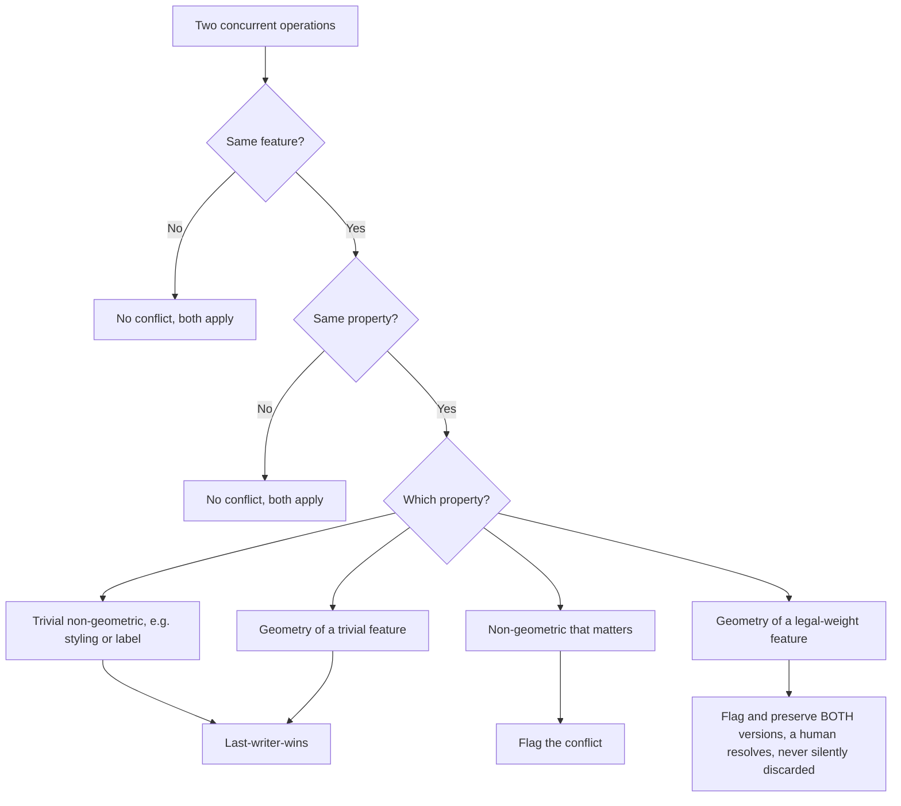
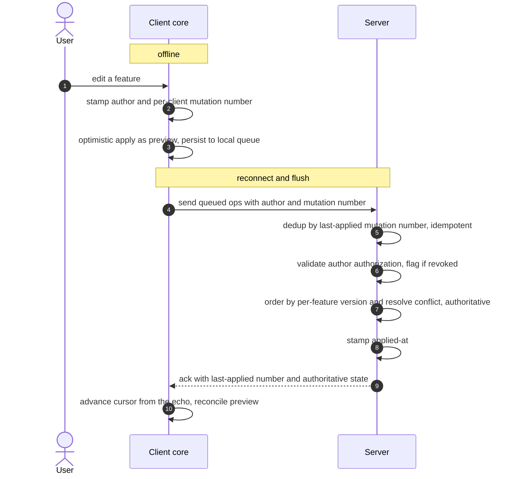
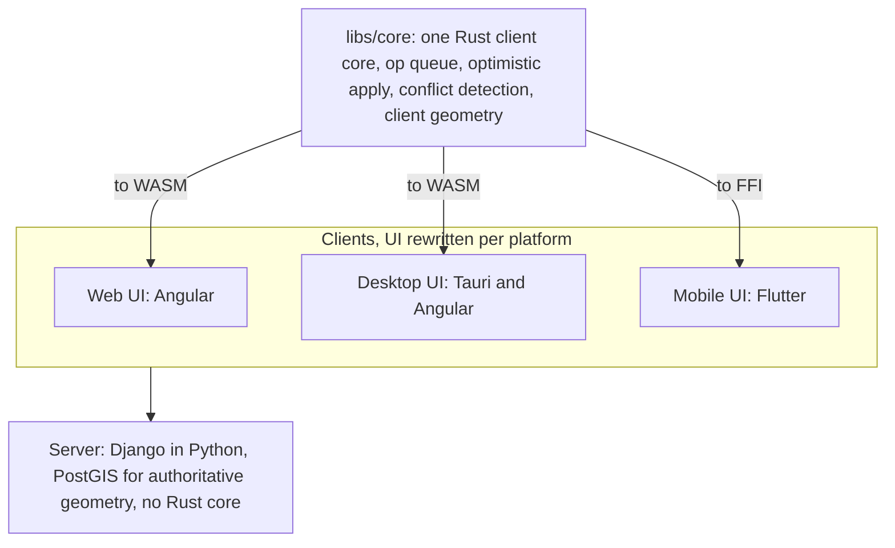
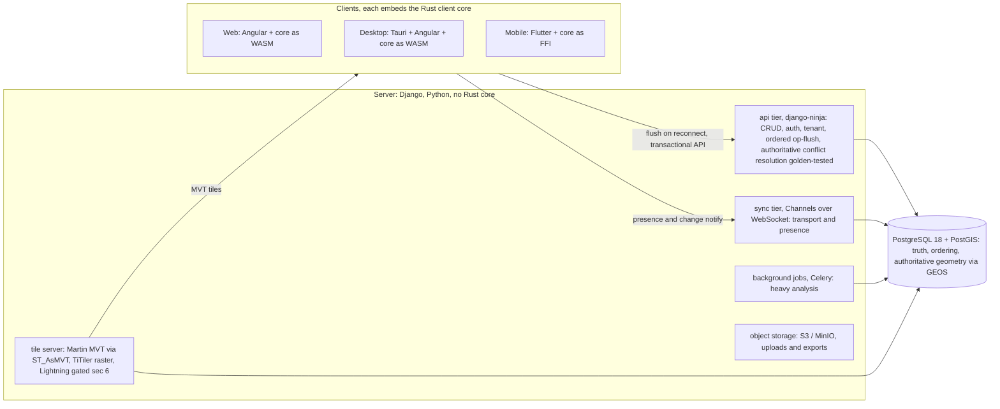

# Mapsift Foundation

> **Status:** living document, foundation v0.17.1 (2026-08-05). Supersedes v0.17; revisions in section 15.
> **Authority:** this is the single source of truth for Mapsift. Every other document
> (PRD, ADRs, per-task specs, CLAUDE.md constraints, Linear issues) derives from this
> file and must not contradict it. When a derived document and this file disagree, this
> file wins until this file is explicitly revised. Revisions are logged in section 15.
> **Scope:** this document is the *what* and the *why*. It does not specify APIs, schemas,
> or code shape; those live in the PRD (the *how*, one layer above code) and the ADRs
> (code-shape decisions). It closes the decisions that everything else depends on and
> records the tradeoffs behind each one.
> **Market references:** references to other tools in the market are cited by code (MC-01,
> MC-02, and so on), defined in the internal market-research document `specs/market-reserarch.md`.

---

## 0. How to read this document

Mapsift is **early**. A scaffold exists and runs, containerised, with the four ecosystems building, type
checking and testing green, and no product capability is built yet. This document exists
so that a person or an LLM can read it cold and understand what Mapsift is, who it is for,
what problem it solves, and which architectural decisions are already closed (with the
reasoning and tradeoffs behind them) versus which are still open.

Read section 0.5 (Product philosophy) first: it is the plain-language frame, the soul of the product written
for a director or a first-day reader, and everything from section 1 onward is its technical consequence, so
the rest reads as a chain of consequences rather than a list of choices.

Three kinds of statement appear here, and they are not equal:

- **Closed decisions** carry a *Decision* block with *What this buys* and *What this costs*.
  These are settled. Do not reopen them without a logged revision in section 15.
- **Invariants** (section 11) are properties that must always hold. They become pass/fail
  acceptance tests in the PRD. Breaking one is a regression, not a tradeoff.
- **Open questions** (section 13) are explicitly *not* decided. Some are gated behind a
  spike with an exit criterion. Do not invent answers to these; flag them.

#### Scope policy: what this document decides, and what it does not

This document decides **what Mapsift will and will not contain**, with the load-bearing technical reasons
behind each choice. Mapsift is a **closed-scope, non-MVP product**: the full scope is built point by point
to completion. Release versioning, delivery order, and roadmap are deliberately **out of scope here** and
live elsewhere (a backlog or roadmap, once a versioning scheme is chosen). Two consequences a future reader
must respect: do not reintroduce release-phase reasoning ("ship this part first") into the foundation, and
do not use "cut it to ship sooner" as an architectural argument, because shipping sooner is not a goal of
this product. KISS still governs, but the rule is **the simplest thing that actually solves the real
problem**, not the simplest thing that proves a thesis fastest. Where this document marks a technical
**gate** (a boundary crossed when a measured condition is met, such as the tiling gate in section 6), that
is an architectural decision, not a release phase.

Why non-MVP is rational here, and only here. An MVP exists to answer two questions before a large build cost
is spent: whether the idea is worth building at all (market uncertainty), and what the right scope is (so the
build does not pour into the wrong thing). Both legs assume the cost of building the whole is high. Neither
leg holds for Mapsift. The scope is a deliberate decision by the client and owner and it precedes the market:
the market is treated as a consequence of a good product, not the input that defines what to build. And under
this team's development method the build cost of the whole is low enough that the time-versus-reward of
building it all is small, with an acceptable worst case (a portfolio-grade tool, or an open-source tool that
someone adopts). This is contextual, not a claim that MVPs are bad: in 2020, with a human typing every line,
the cost leg would hold and an MVP would be the correct path; the development method is what removed that leg.
And non-MVP does not mean no validation. Feedback is embedded during construction, through the in-team domain
expert and through access to real environmental users (from testing through actual use), so the uncertainty in
the open questions is resolved by real use during the build rather than by a prematurely cut-down public
release. What non-MVP removes is the cut-down public release, not the feedback loop. (The development-method
details that make the build cost low live in the handoff and CLAUDE.md, not here; only the economic reasoning
belongs in the foundation.)

A note on reading this document's reasoning. The why is written in with context on purpose, because context
changes the meaning of a word and different projects have different needs. A decision here holds because of
conditions that are true for this project (this team, this method, this client-defined scope, this
legal-weight domain). Do not transfer a decision from this project to another without re-reading the context
that justifies it: the same word ("non-MVP", "offline", "simple", "shared core") can mean a different thing, or
be the wrong call, under different conditions.

The reference points used throughout are **MC-03** (a collaborative web GIS) and **Figma**
(a collaborative design tool). Both were studied in depth because they solved the
hard problems Mapsift faces (real-time collaboration on a spatial/visual document,
large-data performance, conflict resolution). Where Mapsift follows or departs from them,
it says so and says why.

---

## 0.5 Product philosophy

This is the soul of the product, written in plain language for someone who will never read the technical
sections: a director, or a new hire on their first day, anyone who needs to understand in about two minutes
what Mapsift is, where it is going, and what it believes. Everything after this section is the engineering
that makes it real.

Mapsift is a tool where several people analyze the same map together, in real time, built for real
environmental work. The people who do this work are stuck today between two bad options. On one side there is
powerful but solitary desktop GIS like MC-02, where collaborating means emailing files around and hoping nobody
overwrites someone else's work. On the other side there are pretty but generic cloud tools that do not speak
the language of environmental work and stop functioning the moment the signal drops in the field. Mapsift
refuses that choice. It is collaborative like a shared document, it is a real map tool, it speaks the language
of vegetation cover, deforestation, and preservation areas, and it keeps working when the internet disappears,
because the engineer is out in the field, under the sun, and the field has no wifi.

What we believe is that the work must never stall. You draw, edit, measure, and see the result immediately,
with or without internet, and when the connection comes back everything merges without trampling anyone else's
work. And when what is at stake carries legal weight, a reserve boundary or a preservation area, the tool never
silently erases what someone did: it stops, shows both versions, and lets a human decide, because there an
error is not cosmetic, it is a legal problem. This is the product's moral line: speed and autonomy for the
user, and zero tolerance for losing data that matters without a person seeing it.

It also has to feel a certain way, and this is the part that is easy to get wrong. Professional and simple are
not opposites, even though most products treat them as a choice you have to make. The market split into two
camps: MC-02, which mistakes complexity for power, and tools that mistake simplicity for stripping the serious
things away until they feel childish. Mapsift wants both, and they fit together because they answer different
questions. Professional is about how much depth the tool actually has. Simple is about how much of that depth
it throws at you at once. Simple does not mean having less; it means hiding the weight until the moment it is
needed. The reference for this is Google Earth: an enormous amount underneath, planet-wide satellite imagery,
terrain, layers, and on the surface just a globe and a search box; all the power is there, it only appears when
you go looking for it. Google Earth is a philosophy reference, not a screen to copy. Mapsift takes its way of
thinking (depth hidden, the common path obvious, everything fluid) but designs its own screens, partly because
Earth is a tool for exploring while Mapsift is a tool for editing together, so the soul transfers even though
many of the specific elements do not.

There is an experience goal here that sounds subjective but is not. When an engineer prefers one tool over
another and cannot quite say why, just "I don't know, I prefer this one", it is almost always a sum of small
things that nobody notices one by one but that together become a feeling: the tool responds fast, so the train
of thought is never lost; the flow has fewer steps; the behavior is consistent, so what you learn in one corner
still holds in another; and friction has been removed from so many small places that using it becomes instinct.
That sense that "it is just better" is not taste. It is design plus performance, and it is an explicit goal of
Mapsift.

From this follows the one design rule worth quoting on its own:

*When a feature is designed, the question is not whether it has the capability, it is whether the professional
gets the full power without the beginner drowning in it.*

Capability is never in question; what changes is how much of it the surface throws at you before you ask for
it. That is the practical meaning of professional yet simple, and it is the reason an engineer ends up
preferring one tool's version of the very same function over another's.

This fluidity is not decoration, and it is not free. It is exactly what the hard performance requirement, the
offline-first feel, the server-authoritative truth, and the shared Rust core, all decided later in this
document, exist to deliver. The philosophy is the why; the technical decisions are the how.

Everything below, the collaboration model, the offline limits, the data model, the cross-platform core, is the
engineering that makes this philosophy real, and the philosophy is the reason those decisions look the way they
do.

---

## 1. What Mapsift is

### 1.1 The problem

Environmental and geospatial analysis today is split between two bad options. On one side,
desktop GIS (MC-02, MC-01 Pro) is powerful and works offline, but it is single-user by
nature: collaboration happens by emailing files, versions drift, and two people cannot work
the same map at the same time. On the other side, the modern collaborative web GIS (MC-03 and
similar) brought maps into the browser with real-time multiplayer, but it is general-purpose
cartography, it has no real offline mode, edits do not sync back to the source, and the
domain tooling for environmental work is not the point of the product.

The result is that an environmental team doing vegetation-cover assessment, change detection,
or preservation-area delineation either works alone in desktop GIS and reconciles by hand, or
pays for a generic cloud tool that does not speak their domain and stops working the moment
the connection drops in the field.

### 1.2 Who it is for

Mapsift is for professionals who do **collaborative environmental and land analysis**: environmental
and forestry consultancies, agribusiness land teams (georeferencing, preservation areas,
legal reserve), and analysts working with vegetation cover, deforestation and change detection.
The defining trait of the user is not "makes maps" but "needs several people to analyze the
same territory together, with domain tools, and to keep working when the network does not
cooperate."

The product is built by a small team (initially three people: two developers and one
environmental/GIS engineer). The engineer is the embedded domain authority, not an afterthought;
the analysis workflows in the product come from real practice, not from guessing what GIS
users want. Go-to-market, pricing, and the exact target segment are business decisions outside
the scope of this document (see OQ-7).

### 1.3 What Mapsift is, in one paragraph

Mapsift is a **collaborative GIS with general-purpose technical depth**, available as a web app and as a
desktop app from one codebase, where multiple people edit the same map in real time and the work keeps going
when the connection drops. Its technical depth is at the level of desktop GIS like MC-02 in the capabilities it
covers, and it is **not capped by the domain**. Its **anchor domain is environmental and land analysis**
(vegetation cover, change detection, preservation areas, georeferenced parcels): the use case that guides how
the tool is packaged and who its first users are, not a limit on its technical capability. Depth and domain are
two independent axes and are not traded off against each other. It is explicitly **not** a marketing-map or
story-map builder, and it does not aim to cover every domain of GIS; section 12 records those exclusions and why
each is about **purpose, not depth**.

---

## 2. The core thesis: server-authoritative with offline (the one idea everything derives from)

This is the architectural core. Get it wrong and nothing else makes sense.

Mapsift's collaboration model is **server-authoritative with offline support**, in the shape that
Figma uses, **not** local-first with CRDTs in the shape originally sketched in early planning.
The distinction is load-bearing and is the most important decision in this document.

- **Local-first with CRDTs** means the client is the source of truth and the server is a replica;
  the system can run without a server indefinitely, and convergence is guaranteed by the data
  structure itself (e.g. Yjs). It buys peer-to-peer-grade autonomy at the cost of CRDT memory
  overhead and the unsolved problem of CRDTs over shared geometry.
- **Server-authoritative with offline** means the server is the source of truth; each client holds
  a working copy and a local queue of operations that survives a network drop, and on reconnect
  the **server defines the order of operations and resolves conflicts**. Offline is a degraded but
  fully usable mode, not the natural resting state.

The user-facing feeling that Mapsift wants, the work does not freeze when the internet drops, is
delivered fully by the second model. "Local-first" is therefore a **sensation Mapsift delivers**
(your work continues offline), **not an architecture that forces the client to be the truth**.

#### Why this model and not CRDTs

Both reference products rejected CRDTs after studying them, and they did it for the same reason.

MC-03's CTO stated plainly that they use no CRDT or OT structures, and instead structure the data
deeply so that merge conflicts rarely happen; the product insight is that simultaneous edits to
the *same* geometry are extremely rare, and the real value of real-time collaboration is presence
(seeing other people's cursors and knowing there is one version in the cloud), not concurrent merge
of the same shape.

Figma went further and proved the model *with* offline. Figma rejected both Operational
Transformation and pure CRDTs in favor of a server-authoritative system inspired by a
last-writer-wins register at the property level, where the server defines event ordering (so no
vector clocks, no timestamps, no tombstone garbage collection). Figma runs this at a scale of
billions of changes per day. The transferable lesson: when a domain has a natural conflict
granularity, a far simpler system than general-purpose CRDT or OT is both correct and cheaper.
Mapsift's domain has exactly such a granularity: a feature, and a property within a feature.

#### Decision

> **Decision (closed 2026-06-23; conflict model refined in v0.2):** Mapsift uses a server-authoritative
> collaboration model with offline support, in the Figma shape (client-generated IDs, a persistent local
> operation queue, conflicts resolved at the property/feature level with the server defining order, and
> real-time presence when online). How a conflict resolves at that granularity, and the legal-weight
> exception that preserves rather than discards, are specified in section 4. CRDTs (Yjs) are removed as the
> default mechanism. CRDTs return to consideration only if a spike proves the resolution model loses
> unacceptable amounts of edit in a real Mapsift workflow (see OQ-2).
>
> **What this buys:** a simpler, proven, lower-memory system; the offline feeling the product
> wants; convergence guaranteed by server ordering; alignment with how both reference products
> actually work.
>
> **What this costs:** the client is not the ultimate source of truth, so true peer-to-peer or
> server-less operation is off the table. Conflicts are resolved by **granularity rather than by
> session** (section 4): most concurrent edits do not actually collide, trivial collisions resolve
> last-writer-wins, and a collision on legal-weight geometry is flagged and both versions preserved
> for human resolution, never silently discarded. The v0.1 framing that "conflicts are rare so a
> discarded edit is acceptable" was corrected in v0.2: that rarity is manufactured by online presence
> and a low-stakes artifact (the Figma and MC-03 setting), and Mapsift removes both conditions
> (offline-first, legal-weight geometry), so silent discard is not an acceptable default here.

---

## 3. The data model frontier: elements vs layers

Mapsift draws the same fundamental line MC-03 draws, between **elements** and **layers**, and this
line is also the local-first frontier (what lives and edits on the client versus what is served
and consumed).

- **Elements** are what a human creates and edits by hand: drawn points/lines/polygons,
  annotations, attributes the user types, styling, comments. They are light. They are the live,
  collaborative, offline-capable surface of Mapsift.
- **Layers** are data brought in or derived and processed by a pipeline: rasters, satellite
  imagery, large imported vector datasets (e.g. official deforestation/land-cover layers), and
  analysis outputs. They are heavy. They are served as tiles and consumed; they are not loaded
  whole into the client.

> **Decision (closed, 2026-06-23):** the local-first surface is the **elements** layer only. Elements
> are genuinely local-first (held on the client, editable offline, synced via the model in section 4).
> Layers are server-authoritative and served as tiles (section 6). Mapsift stops calling everything
> "local-first"; the frontier is this elements/layers line.
>
> **What this buys:** the human's work is genuinely responsive and offline-capable; the heavy data
> never threatens client memory because it is never fully in the client.
>
> **What this costs:** a layer is not freely editable as a live collaborative object the way an
> element is; editing layer data goes through the heavier path in section 6, and the conversion
> between the two (section 7) is an explicit operation, not automatic.

Performance is a hard requirement, not a preference. Whenever a choice trades user-facing speed
for architectural convenience, speed wins. The elements/layers split exists primarily to protect
performance: keep the light thing live and the heavy thing tiled.

---

## 4. Collaboration and sync

This section specifies the mechanism behind the section 2 thesis, translated to Mapsift's domain.
It has four parts.

**1. Client-generated IDs.** Every feature gets a globally unique ID generated on the client (UUID),
so a user can create a feature while offline without asking the server for an identifier. This is
the piece that makes offline creation possible without collision; it is the same move Figma makes.

**2. A persistent local operation queue.** Every edit made offline is appended to a local queue that
**persists across app restarts**, behind a narrow storage interface (IndexedDB or OPFS on web; a SQLite
adapter on desktop behind the same interface, see section 5). Closing the tab or the app does not lose
unsynced work. (This deliberately fixes a known weakness of MC-03, where closing the browser loses unsynced
edits.)

**3. Server-ordered application on reconnect, resolved by granularity.** On reconnect, the client flushes
its queue; the server (PostgreSQL, the source of truth, see section 10) orders the operations and applies
them at the granularity of a property on a feature. Two users editing different features never conflict;
two users editing different properties of the same feature never conflict. A real conflict exists only when
two operations touch the **same property of the same feature**, and how it resolves depends on what the
property is and how much it is worth. The resolution model is below.

**4. Real-time presence when online.** Cursors, selection, and who-is-editing-what are broadcast over
WebSocket while online. This is where the real value of live collaboration sits. Presence is an
online-only feature and degrades silently offline.

#### Conflict resolution by granularity, not by session

The v0.1 default ("last-writer-wins on the whole feature geometry, the loser's edit discarded, conflict
flagging an exception") had the default inverted for this domain. The Figma model treats a discarded edit
as cheap because its conflicts are rare (rarity manufactured by live presence: you see the other person's
cursor and do not grab the same node) and its artifact is low stakes (a design property redone in seconds).
Mapsift removes both conditions: it is offline-first, so there is no presence to make collisions rare, and
some geometry carries legal weight (a preservation area boundary, a georeferenced registry parcel), so a
silently dropped edit can be a compliance event rather than a cosmetic loss. MC-01's versioned sync path and
MC-05 both detect and preserve on conflict instead of silently discarding; Mapsift follows that, not
the design-tool default.

Resolution is defined by **granularity**, from cheapest to most expensive:

- **Different features edited:** no conflict; both apply automatically.
- **Same feature, different properties** (one edits the geometry, another edits an attribute): no
  conflict; both apply, because the resolution unit is the property, not the feature.
- **Same non-geometric property of the same feature:** light conflict. A trivial property (styling, a
  label) resolves last-writer-wins; a property that matters flags a conflict.
- **Geometry of the same trivial feature** (an unclassified annotation or sketch): last-writer-wins is
  acceptable.
- **Geometry of the same legal-weight feature:** the conflict is flagged and **both versions are preserved
  for human resolution; the loser is never silently discarded.** This is the default for legal-weight
  features, not the exception.

The same ladder as a decision flow:

> **Decision (revised 2026-06-23, v0.2):** conflict resolution is defined by granularity, not by session.
> Last-writer-wins applies only to trivial properties and trivial-feature geometry. For a legal-weight
> feature (classification below), a geometry conflict is detected, both versions are retained, and a human
> resolves it; silent discard of a legal-weight geometry edit is prohibited. This supersedes the v0.1
> whole-feature last-writer-wins default and closes the strongest finding of the adversarial review.
>
> **What this buys:** the cheap path stays cheap (most concurrent edits never collide and resolve
> automatically), while the expensive, legally meaningful case never loses data without a human decision.
>
> **What this costs:** the system must do conflict **detection** (per property, and for geometry on the
> same feature), **retention** of the losing version, and a **resolution UI**. All three are built on the
> append-only operation log the sync model already produces, so the loser is data the system already holds,
> not data it must reconstruct. This is cheap next to CRDT convergence math: it is detect, keep, and
> present, not merge.

Two honest caveats are logged as open questions: the real same-feature conflict rate in field-plus-office
work is unmeasured, and the design no longer depends on it being low (OQ-11); and whether Brazilian norms
mandate an immutable edit-level trail is unconfirmed and is not asserted as law here (OQ-12).

#### What counts as legal-weight

The preserve-versus-discard split depends on knowing which features carry legal weight.

> **Decision (closed 2026-06-23, v0.2):** legal weight is a **configurable per-layer attribute**, with a
> default set of types pre-marked as legal: preservation area (APP), legal reserve, and georeferenced
> registry parcel. The **tenant** can additionally mark other layers as legal-weight. (The v0.2 text said
> "workspace" here; v0.11 moved the isolation boundary to the tenant and this sentence was not rewritten with
> it, corrected in v0.12. The workspace still exists as an organisation and permission level, and marking
> legal weight is a tenant-level act because the consequence is legal, not organisational.)
>
> **What this buys:** the conflict model has a concrete, inspectable input (a flag on the layer) instead of
> a hidden heuristic, and the safe default already covers the obviously legal types.
>
> **What this costs:** the default set is a starting point, not the final domain rule. The exact
> classification (which types are always legal by nature versus user-marked) is domain knowledge owned by
> the environmental engineer and is left open (see OQ-8).

#### Versioning and history

Two distinct mechanisms, which must not be conflated:

- **Per-user undo:** undoes the acting user's own operations, Figma-style (an undo is itself an operation
  that modifies the redo history). It is local to the user and does not touch other people's work.
  Collective (multi-user) undo is a harder, separate problem and stays gated in OQ-1.
- **Conscious version snapshots:** named snapshots of the map that a user deliberately creates (for example
  "before client review"), restorable later. The critical rule: **restoring an old version creates a new
  version holding that content; it does not delete what came after.** A global time machine that overwrote
  later work would be the silent-discard sin re-entering through the back door, and is prohibited for the
  same reason.

> **Decision (closed 2026-06-23, v0.2):** Mapsift provides per-user undo and user-created restorable version
> snapshots. Restoring a snapshot is additive (it creates a new current version); it never destroys later
> versions.

#### Limit: no sub-geometric merge of the same feature

When two users redraw the geometry of the same feature offline, Mapsift does **not** attempt to fuse the two
geometries into one. There is no correct automatic fusion: any merge rule invents a polygon that neither
user drew, which for legal-weight geometry is a compliance hazard, not a convenience. Instead the product
presents both whole geometries side by side and the user picks one or redraws using both as reference. This
is a deliberate product limit, recorded here so it is not mistaken for a missing feature.

#### Delete versus edit

A delete is an operation like any other, but a delete colliding with a concurrent edit of the same feature
is not symmetric with an edit-edit collision, so it is called out. For a trivial feature the server order
decides (a later delete removes it; a later edit keeps it). For a **legal-weight feature, a delete that
collides with a concurrent edit does not silently win**: the feature does not vanish or resurrect without a
record. The collision is flagged and both the deletion intent and the surviving edited geometry are retained
for human resolution, consistent with the preserve-not-discard rule above.

> **Decision (closed 2026-06-23, v0.2):** for legal-weight features, a delete-versus-edit collision is
> flagged and retained, never silently resolved; a legal-weight feature is never removed or restored without
> a recorded decision. The trivial-feature rule and the precise retention semantics are left to the PRD
> (see OQ-13).

#### Heavy-data edits use a different channel

Edits to **layer** data (heavy, section 6) do not flow through this element operation queue. They write
directly to PostGIS and are reflected through the served tiles; if and when the tiling gate in section 6
introduces pre-generated base tiles plus merge-on-demand, layer edits accumulate as an edit delta merged per
feature. Either way the philosophy is the same (server reconciliation), at a different granularity from
elements: elements sync via the operation queue, layers go through the tile and database path.

#### State reconciliation: idempotency and partial-failure recovery

The op queue, server ordering, and gap detection with resync (section 10) leave one case unclosed: a flush
interrupted midway (a client crash, or a dropped connection after the server applied some operations but before
the client saw the ack). Without an idempotency guarantee, a resend either duplicates the already-applied
operations or loses the unacked ones. The established pattern for an operation-queue (mutator) sync model is
the one Replicache and its successor Zero use: a per-client monotonic mutation number carried on every
operation, and a per-client last-applied mutation number tracked on the server. This is distinct from and
complementary to the per-feature version: the per-feature version orders operations and detects conflict; the
per-client mutation number gives queue idempotency and dedup.

> **Decision (closed 2026-06-23, v0.7):** every operation carries a per-client monotonic mutation number,
> persisted in the queue with the operation. The server tracks, per client, the highest mutation number it has
> applied. On flush the server applies operations in order and ignores any whose mutation number is at or below
> the last-applied for that client (dedup), which makes resend idempotent. On reconnect after a partial flush
> the client resends its persistent queue from the last known ack; the server skips what it already applied and
> applies the rest. Nothing is lost (the queue is persistent and append-only) and nothing is applied twice
> (dedup by mutation number). This coexists with the per-feature version: feature version orders and detects
> conflict, mutation number gives queue idempotency.
>
> **What this buys:** partial failure (the common offline case) is recoverable by construction, not by ad hoc
> retry logic.
>
> **What this costs:** the server keeps a small per-client cursor (the last-applied mutation number), and the
> client tags every queued operation with its sequence; both are cheap.

The v0.7 decision established the per-client mutation number and the per-client last-applied cursor for dedup,
and left two protocol holes. First, the document says the client resends from the last known ack but never
established that the server returns the last-applied mutation number in the flush response; without that echo
the client cannot advance its cursor, and either resends the whole queue on every reconnect (correct but
wasteful) or advances blindly and loses operations. Second, "per-client" was never defined: if the cursor is
per-user, the same user on the field tablet and on the office desktop becomes two independent mutation-number
streams colliding on the same cursor, and the server drops a legitimate operation from one device by false
dedup, thinking it already saw that number from the other. That is silent data loss, the sin the whole product
swears not to commit.

> **Decision (closed 2026-06-23, v0.8):** first, the flush protocol requires the server to return the
> per-client last-applied mutation number in its response, and the client advances its cursor only from that
> echo, never by assumption. Second, a client in the mutation-number sense is a persistent instance identified
> by a clientID generated and persisted locally per installation or instance, not the user; the same user on
> two devices is two clients, with two independent mutation-number streams and two cursors; the clientID uses
> the same client-side identifier-generation mechanism already established in I3.
>
> **What this buys:** idempotent resend that converges without resending the whole queue, and no loss to false
> dedup between two devices of the same user.
>
> **What this costs:** the server keeps one cursor per clientID, which grows with the number of instances.
>
> **Note for the PRD:** a per-clientID cursor grows without bound if a client disappears, so it needs a
> clientID expiry and garbage-collection policy, a problem Replicache already solves. It does not block the
> foundation; recorded as a PRD item.

The full lifecycle of one operation, from offline creation to authoritative reconciliation:

---

## 5. Offline domain limits

Offline is defined along **two dimensions**, not one. Confusing them is how the offline promise
becomes a lie.

**Dimension 1, data type:** elements (light, offline-capable) vs layers (heavy, served). Already
established in section 3.

**Dimension 2, platform:**

- **Web (browser):** offline is **session-scoped**. What the session has loaded stays editable; the browser
  never held the whole multi-gigabyte project. Storage is a single client persistence layer, IndexedDB (or
  OPFS if more volume or structure is needed; one is picked, not both), bounded by per-tab memory limits.
- **Desktop (Tauri):** a project-scoped offline mode (heavy data in a local store, the whole project
  workable without a network, the MC-02 expectation) is a **distinct capability with its own persistence and
  sync surface**, not yet designed, and is an open question (OQ-9). It does not transfer to the web tier, and
  the product must not pretend the web tier offers it.

> **Decision (revised 2026-06-23, v0.2):** the decided architecture is **a single client persistence layer
> on web, behind a narrow storage interface**. The sync engine is platform-agnostic (pure functions over the
> operation log, matching the test-first method in section 14), and persistence sits behind that interface. A
> desktop build adds a SQLite adapter behind the same interface: one sync engine, two storage adapters, never
> two sync surfaces. The desktop project-scoped (heavy-data-offline) mode is a separate, separately-designed
> capability and remains an open question (OQ-9).
>
> **What this buys:** the most fragile surface (offline persistence plus sync replay) is built and proven
> once, on one platform, before it is stressed by a second store.
>
> **What this costs:** the project-scoped, whole-project-offline experience is not part of the decided
> architecture; it depends on the separate design tracked in OQ-9.

#### What works offline

- Editing already-loaded elements: draw, move vertex, edit attribute, style.
- Viewing already-cached layers and tiles.
- Light client-side analysis: area, perimeter, buffer, distance/measurement, simple intersection
  (pure geometry in the client).

#### What requires a connection (unavailable offline, with clear feedback)

- Importing data the client cannot hold or cannot read (see the qualification below).
- Pulling Copernicus / satellite imagery (network and a monetary cost in processing units).
- Heavy server-side analysis: NDVI over raster, change detection, anything routed through the job
  queue or the raster tiler.
- Geocoding.
- Real-time presence (cursors), which needs the WebSocket.
- Loading a tile that is not yet cached.
- The AI agent (section 9.5.1): it orchestrates a cloud LLM and runs server-side, so it needs the network.

#### Importing offline: qualified, not forbidden

The v0.1 through v0.11 text listed importing new data as unconditionally online, on the reasoning that the
server must process and tile it. That reasoning is right for the data it was written about and wrong as a
blanket rule, because it fuses two independent conditions. An import is offline-capable when **both** hold:
the client can **read** the format with its own readers, and the result **fits the light path** (the element
class, within the measured element budget). A small hand-sized vector file dropped on the map offline is an
element edit like any other and there is no reason to refuse it. A raster, a large vector, or a format that
needs server-side processing is a served layer, needs the server, and is refused with feedback.

> **Decision (closed 2026-07-30, v0.12; qualifies the section 5 list):** importing is **not** unconditionally
> online. An import proceeds offline when the client can read the format and the result stays inside the light
> element path; otherwise it requires a connection. **The surface tells the user which case they are in before
> the work is lost**, not after: a file that cannot be imported offline is refused with the reason (the format
> needs server processing, or the dataset exceeds the element budget), and never queued as if it would sync.
>
> **What this buys:** the field case that actually happens (dropping a small vector file on a tablet with no
> signal) works, without pretending the heavy path does.
>
> **What this costs:** the client carries readers for the offline-capable formats, and the classification must
> be decided **before** the file is accepted, so the feedback is honest rather than a failure after the fact.
> Which formats are client-readable is a PRD concern (B2), bounded by this rule.

The rule of thumb is the Figma rule: **what is loaded keeps working; what needs the server is blocked
with clear feedback.** Once the desktop project-scoped mode (OQ-9) is built, desktop extends "what is loaded"
to "the whole project"; until then desktop offline is the same session-scoped mode as web, which keeps it at
"what the session brought in."

> **Decision (closed 2026-06-24, v0.10):** the AI agent is an online-only capability; it is orchestrated on the
> server and consumes the capability layer server-side. The offline client keeps operating without an agent.
> This does not weaken the offline promise: the agent is an online consumer of the same layer (section 9.5.1),
> not an exception to the offline-first spine, the same way the OQ-1 topological propagation is online-only.

---

## 6. Large data: dynamic tiles, pre-generated tiles gated by measurement

The classic GIS tradeoff is "fast tiles or editable data, never both." MC-03 eliminated it in late 2025 with
an architecture called Lightning: base tiles produced once by a tiler (Tippecanoe-class, served as MVT), an
edit database that records only the delta, and a merge-on-demand engine that combines base tiles with live
edits at request time, with a background process that folds edits back into the base tiles so only a small
fraction of data is ever merged dynamically. It is the proven production answer at scale, and it is also
months of engineering: MC-03 is a team of dozens and shipped Lightning years after founding. For a
three-person team it is the right answer to a measured scaling problem once that problem is real, not a cost
paid up front before it is.

> **Decision (revised 2026-06-23, v0.2):** large imported vector and analysis layers are served as **MVT
> tiles over PostGIS**, and the build is gated on a measured condition.
>
> - **Default path:** large vector is served as dynamic MVT generated straight from PostGIS (ST_AsMVT)
>   through a tile server (Martin is the leading candidate, see section 10), with edits writing directly to
>   PostGIS tables and tile caching at the HTTP layer. Large vector still does **not** enter the client
>   operation queue or any CRDT structure.
> - **The gate, triggered by a measured condition:** when dynamic generation becomes a measured bottleneck at
>   real feature counts (the per-tile budget of I6 being exceeded), Mapsift introduces pre-generated base
>   tiles (Tippecanoe/PMTiles) for the static bulk plus a merge-on-demand path for the edited delta, which is
>   the Lightning shape. The edit-delta store and merge engine are built then, against a real bottleneck, not
>   speculatively.
>
> **What this buys:** the default path runs on pieces the stack already has (PostGIS, ST_AsMVT, a tile
> server) without first building the edit-delta store and merge engine; the heavy build is deferred until
> profiling proves it is needed.
>
> **What this costs:** dynamic MVT generation **degrades with feature count at low zoom on very large
> layers**, which is real and is reflected honestly in invariant I6 (section 11): the dynamic-MVT path is
> responsive up to a per-tile feature budget, and crossing that budget is the trigger that gates the move to
> pre-generated tiles, not a surprise.

---

#### External data sources are a pluggable provider, never a hard-coded vendor

Mapsift consumes data it does not own: imagery catalogues, national vector services, cloud databases. Binding
any of them into the product directly would fuse a business relationship into the architecture, which matters
here for three reasons that are not hypothetical. The default imagery source carries a **metered cost** whose
model is still open (OQ-3), so the ability to move is commercial leverage rather than tidiness. A national
service is a **jurisdictional** dependency, and Mapsift is not capped to one market (section 1.3). And a
provider disappearing, changing terms, or degrading is a normal event on a product with a long life.

> **Decision (closed 2026-07-30, v0.12):** every external data source reaches Mapsift through **one provider
> interface**, and no vendor is hard-coded above it. The default source is one provider among others and holds
> no privileged path. Swapping a provider changes nothing above that interface.
>
> **What this buys:** vendor failover, jurisdictional reach, and negotiating room on a metered dependency, all
> for the cost of an interface that the capability-layer discipline (section 9.5) already demands.
>
> **What this costs:** the interface is designed for more than the first provider, which is mild extra ceremony
> at the start and the usual price of not being locked in. The concrete provider list and adapters are a PRD
> concern (B3).

---

## 7. Analysis results

An analysis output (e.g. a computed preservation area, land-cover classes) is **derived, recomputable
data**, so it is born as a **served, recomputable layer** (section 6), regenerated when its inputs
change, and it does **not** go into the elements operation-queue path.

But when a user wants to adjust a result by hand (nudge a boundary the model got slightly wrong), the
result can be **promoted to an editable element**, at which point it becomes a human feature and enters
the live collaborative/offline path of section 4. This is the same element-to-layer conversion (and back)
that MC-03 supports for annotations and layers.

> **Decision (closed 2026-06-23; bounded in v0.2):** analysis results default to served recomputable layers,
> with an explicit "promote to editable element" operation for hand adjustment. Promotion is **bounded**: the
> editable element working set has a cap (target set in the PRD), so a large layer cannot be promoted
> wholesale into live editing. Promotion targets the specific features a human takes ownership of, not a
> million-feature layer at once (the reason is the rendering constraint in section 8).
>
> **What this buys:** results stay cheap and recomputable by default; they become live only when a human
> takes ownership of the editing, and the live-editable set stays small enough to render and edit
> responsively.
>
> **What this costs:** the promote operation, the cap, and the question of what happens to a promoted element
> when the underlying analysis is recomputed, must be specified (see OQ-6).

---

## 8. Rendering

MC-03 renders in HTML Canvas, a choice they made around 2020 with the reasoning that SVG was too high-level
and WebGL too low-level. That reasoning is dated. In 2026, MapLibre GL JS over WebGL, consuming MVT, is the
mature industry-standard path, and it renders large data via tiling rather than by loading everything into
the client.

> **Decision (closed, 2026-06-23):** rendering uses **MapLibre GL JS (WebGL)** consuming MVT tiles. Mapsift
> does not inherit MC-03's Canvas choice.
>
> **What this buys:** a mature, standard, GPU-accelerated renderer with native vector-tile support and a
> large ecosystem; volume handled by tiling, not by client-side overload.
>
> **What this costs:** WebGL's usual constraints (context limits, some device variance); accepted as the
> standard tradeoff of the modern stack.

**The editing restriction that comes with this choice.** MapLibre is a renderer, not an editor. Interactive
geometry editing (vertex drag, snapping) is done by a separate library (Terra Draw and Geoman are the mature
MapLibre-compatible options in 2026), and every such library keeps the features under live edit in a
client-side GeoJSON source, which MapLibre reprocesses on each change. Editing millions of features that way
is the trap. Mapsift avoids it by construction: the elements/layers split (section 3) renders the volume as
MVT tiles on the GPU and keeps only the small set of elements under live edit in the GeoJSON source. This is
why the editable working set is capped (section 7) and why "promote a whole layer to editable" is not
offered. Vertex editing and snapping are commodity in this ecosystem, and snapping gives **shared-edge
coincidence at draw time**; a shared topological **structure** where moving an edge propagates to neighboring
faces is not off-the-shelf and is an online, server-side operation (PostGIS Topology), reframed in OQ-1.

---

## 9. Multi-tenancy and permissions

Mapsift is multi-tenant: work belongs to a **tenant** (the top container of an account, a personal user
account or an organization), and data must not leak across tenants. Tenant isolation is enforced **at the SQL
layer, not only in the ORM**: the tile server (Martin / ST_AsMVT, section 6) and other integrations query
PostGIS directly, outside Django's ORM, so an ORM-level tenant filter would leave the tile path uncovered.
Isolation is therefore guaranteed in the database itself (PostgreSQL row-level security, or per-tenant views
that every reader including the tile server goes through), so cross-tenant read or write is impossible by
construction, not by convention. This is an invariant (section 11, I4), tested, not a guideline. The detailed
permission model (roles, sharing, view-vs-edit, public embeds) is a PRD concern and is not closed here beyond
the isolation invariant and the tenant-structure decision below.

#### The tenant is the top of the account tree; isolation and permission are different layers

The v0.1 through v0.10 text treated the workspace and the project as one level that both isolated the tenant
and held the work. That is too shallow for Mapsift's actual users, who span two shapes, the freelancer or
small practice and the consultancy with several teams, and it conflated two mechanisms that must stay
separate.

**Isolation and permission are different mechanisms at different layers.** Tenant isolation is the hard wall
in the database (I4, PostgreSQL row-level security): a binary, non-configurable, by-construction guarantee
that a query belonging to one tenant can never read another tenant's rows, covering even the direct-to-PostGIS
readers (the tile server) that bypass the ORM. Access permission is the configurable, shareable, granular
control of who may do what within data the system has already decided this person may see (the
view/comment/edit grant capped by license and a default, deferred to the PRD). Permission is a door with a
lock; isolation is that the neighbour's house is not on your land. One is not a finer setting of the other,
and treating internal confidentiality as if it were isolation, or isolation as if it were a permission, is a
category error.

**The tenant is the top of the account tree, carried as an identifier on the data, not as a fixed named
level.** Tenant and user are not one-to-one: a consultant serves several client organizations and a person
moves between firms, so a global **user** holds the durable identity (the credential, the login) and may
belong to several tenants. The top container of an account is the tenant: for a freelancer it is the
**personal account** (the user is their own tenant, with no organization to create), and for a company it is
an **organization** (optional, present only when a company exists). Isolation rides a tenant identifier on
every row, checked against the session's tenant, so the database refuses any row that does not match, the same
guarantee whether the tree below is shallow or deep. Below the tenant the user shapes a variable-depth tree: a
**workspace** groups projects and is where sharing lives, and a **project** is the deliverable holding the
elements and layers of sections 3 to 8. The depth is the user's choice (a freelancer may keep a single
workspace; a consultancy may run a workspace per team), and because isolation rides the tenant identifier at
the top, that choice never moves the wall.

**Two clients of the same consultancy are not two tenants.** Their data both belongs to the consultancy, the
one entity that holds the contract and answers for the data (the LGPD controller), so the separation between
them is **permission**, not isolation. The hard wall is between organizations (consultancy X must never see
consultancy Y), which the tenant identifier guarantees by construction; walling every client off as its own
SQL tenant would multiply tiny tenants for no real security gain. Internal confidentiality between a tenant's
projects or clients is the permission layer's job.

> **Decision (closed 2026-06-25, v0.11; reopens and supersedes the project-as-tenant framing of I4 and this
> section):** the **tenant** is the **top container of an account**, a personal user account for an individual
> or an organization for a company (the organization is optional), and it is the hard isolation boundary of I4,
> enforced at the SQL layer by a tenant identifier on every row. A global **user** is the durable cross-tenant
> identity and may hold membership in several tenants; a **membership** joins a user to a tenant and carries that
> user's role there. Below the tenant a variable-depth tree (a **workspace** that groups and shares projects, a
> **project** that holds the elements and layers) is **organization and permission, not isolation**: sharing,
> grants, and the license ceiling live here, never a second SQL wall. **Isolation and permission are distinct:**
> isolation is the non-configurable by-construction wall between tenants, permission is the configurable grant
> within a tenant, and confidentiality between a tenant's own clients is permission. The same person on two
> devices is one user with two clientIDs (I9).
>
> **What this buys:** the freelancer has workspaces and projects with no organization to invent; the
> multi-client consultant is one identity across organizations; an orphaned owner is reassigned by a tenant
> administrator because ownership lives on a membership, not a person; and the isolation guarantee is one simple
> tenant-identifier wall regardless of how deep the user makes the tree.
>
> **What this costs:** I4 is reopened (the tenant is the top-of-account container, not the project); the data
> model gains user, organization (optional), workspace, project, and membership; the RLS keys on the tenant
> identifier rather than a named level; and the direct-to-PostGIS tile path must connect under a non-privileged
> role that sets the tenant on the session, or it bypasses RLS and defeats I4 (an ADR and Layer 2 concern,
> flagged here, not solved).
>
> **Deferred to the PRD (the detailed permission model, whose ownership does not change):** the per-tenant
> **governance ladder** (a top administrator who manages members, billing, and security and can reclaim an
> orphaned ownership, with no content override over a project, because governing is not editing); the
> **per-resource access levels** (view, comment, edit, drafted in PRD A3) capped by the license or seat ceiling
> and a default; and **workspace-inherited sharing** (sharing a workspace flows its grant and level to the
> projects within, with an explicit per-project exception the workspace administrator can set, the
> default-with-override shape). One standing constraint binds that work: a governance role never gains a content
> override an editor lacks, and deletion or alteration of a legal-weight feature stays under the
> preserve-not-discard rule of section 4 for every role, the administrator included, because the moral line is a
> property of the data, not of the actor.
>
> **Access denial is revocation, not concealment.** Denying a user access to a resource removes the grant so the
> resource is genuinely unreachable by any path (direct link, API, tile path, search), never merely hidden from a
> listing while remaining fetchable. This is the preserve-not-discard moral line applied to access: as
> legal-weight data is never silently discarded, access is never falsely shown as removed while the data stays
> reachable. Within a tenant, a denied access returns an explicit denial with a resolution path (contact the
> workspace administrator); across tenants, the resource is indistinguishable from one that does not exist, which
> the SQL-layer isolation (I4) already guarantees. The detailed permission model, the grant mechanism, and the
> per-surface denial behaviour are deferred to the PRD.

#### Identity in the offline context

Section 9 defers the detailed permission model to the PRD, but two identity questions are foundation-level,
not PRD: how an offline edit is attributed, and what authority validates it. Both follow the server-authority
spine. Attribution is stamped at creation, not derived at flush, because the token state can change while
offline (a long offline trip can outlive an access token, and the author's permissions can change server-side
meanwhile). Authorization is the server's at flush time, because the client is never the authority. An edit
whose author lost authorization while offline is flagged, not silently applied and not silently discarded (the
same preserve-not-discard rule as legal-weight geometry). The offline credential pattern is the standard one:
a long-lived refresh credential plus a renewable short-lived access token, refreshed on reconnect, with
graceful interactive re-auth if the refresh credential expired or was revoked, and the offline queue persists
until re-auth so no work is lost to an expired token.

> **Decision (closed 2026-06-23, v0.7):** every operation carries the author's identity, stamped at creation
> and persisted in the queue; attribution does not depend on token state at flush. Authorization is the
> server's authority: at flush the server validates that the author still has permission to write (tenant
> isolation I4 plus the PRD permission model); an operation whose author lost authorization while offline is
> flagged for resolution, never silently applied and never silently discarded. The client operates offline on a
> long-lived refresh credential plus a renewable short-lived access token, renewed on reconnect; if the refresh
> credential is expired or revoked, re-auth is interactive and the offline queue persists until then. Transport
> is always TLS.
>
> **What this buys:** an offline edit is correctly and durably attributed, authorization cannot be bypassed by
> editing offline, and no work is lost to a token expiring mid-trip.
>
> **What this costs:** operations carry an author field; the server runs an authorization check at flush in
> addition to ordering.
>
> **Deferred to the PRD (product and security tradeoffs, not foundation):** the exact offline-authenticated
> lifetime, the refresh-rotation policy, and what the resolution UI shows for an authorization-failed
> operation.

The v0.7 decision answered "can this author write" and left three things open, each closed below. First, a
client-side stamp made offline is a claim, not proof: a tampered client authenticated as user A can stamp an
operation as user B, and a server that validates only authorization accepts it and attributes to B a geometry
that A drew. Second, fixing authorship to the session that performs the flush attributes the drawing to whoever
synced rather than whoever drew, which is wrong on a shared device: engineer A draws all day offline, hands the
tablet to the night-shift B, and B syncs. Third, fixing a feature's authorship to a single operation stamp
collapses co-responsibility when different authors edit the same legal-weight geometry, the same class of sin
the preserve-not-discard rule already forbids.

> **Decision (closed 2026-06-23, v0.8), authoritative authorship in three levels:**
> - **Operation authorship.** The authoritative author of an operation is not a free field filled by the
>   client. It is the authenticated identity of the session that created the operation, proved by verifiable
>   session material signed by the server that travels with the operation, and revalidated by the server at
>   flush. It is the identity of creation, not of flush, because the device can change hands between creating
>   and syncing. The author shown in the UI before flush is an optimistic hint for user experience, not
>   authority. At flush the server normalizes authorship to the identity provable from the session material; an
>   operation whose claimed author diverges from that provable identity is never accepted with the claimed
>   author, it is normalized to the proven identity or rejected, and the divergence is retained for inspection,
>   with the handling mechanism left to the PRD. An author who lost write permission while offline has the
>   operation flagged, never silently applied and never silently discarded.
> - **Legal-weight feature authorship.** The legally relevant authorship of a legal-weight feature is not a
>   single stamp derived from one operation. It is the ordered chain of attributed operations that produced the
>   geometry as it now stands, preserved and inspectable, materialized by the append-only operation log the
>   sync already produces. No operation attributed to an author is collapsed or discarded from the feature's
>   history, under the same preserve-not-discard rule. The single-author case is the trivial one, a chain of
>   one author. The multi-author case, where A draws the boundary offline and B adjusts vertices of the same
>   boundary in another session, shows both in the chain, in the correct order, each with its authoritative
>   applied-at. The exact shape of this legal-weight feature authorship trail, under Brazilian norm, is left to
>   OQ-12.
> - **Two times in the trail.** Distinguish created-at, the client's claim about when the operation was
>   created, on an untrusted offline device clock, from applied-at, the server's authoritative stamp at flush,
>   with applied-at being the authoritative one. How the two times enter the audit trail is left to OQ-12.
>
> **What this buys:** forge-resistant authorship at the operation level, correct attribution on a shared device
> with shift handover, legal co-responsibility preserved on multi-author geometry, and a trail with a
> trustworthy authoritative time.
>
> **What this costs:** it requires verifiable session material persisted on the offline client and revalidated
> at flush, and the legal-weight feature authorship trail reads the chain of operations rather than a single
> field. The proof mechanism itself is hard and per-platform and is opened as OQ-18; the authorship rule above
> is settled.

#### Data privacy and security posture

Mapsift stores georeferenced land and environmental data that can contain personal data under Brazil's LGPD
(geolocation is treated as personal data, and a registry parcel can identify an owner), so the foundation
states a posture rather than staying silent. The technical posture is stated here; legal compliance is not
asserted as law (the same stance as OQ-12) and is opened as OQ-16.

> **Decision (closed 2026-06-23, v0.7), technical posture:** data is encrypted in transit (TLS) and at rest for
> production data; collection is minimized to what environmental analysis needs; production data never leaves
> production (I7); provenance of who edited what is retained (the operation log already carries it, see the
> identity subsection above and OQ-12).
>
> **What this buys:** the baseline data-protection controls are stated, not assumed.
>
> **What this costs:** encryption at rest and transport discipline are non-optional operational requirements.

The posture above protects production data on the server. The offline-first model also places the operation
queue and the features in the device's local store, so the offline device (the field tablet above all) is a
distinct exposure vector from the server, with its own per-platform protection tradeoff. This is recognized
here and addressed in OQ-17, not solved in this posture.

#### Regulatory content is per-jurisdiction data, never code

**Context.** Mapsift encodes law. A preservation-area buffer width, the metric frame a certified parcel's area
must be computed in, which feature types carry legal weight, what a deliverable must contain, how long a record
is retained, how a professional attests to a document: every one of those is fixed by a regime, and every one of
them differs by jurisdiction. The product is general-purpose and is not capped to one national market (section
1.3), so a rule burned into a function is a rule that has to be rewritten to serve the next country, and the
rewrite lands in the code that produces legally consequential numbers, which is the worst place for it.

The document already practices this shape in two places and never named it. The metric-frame rule chooses the
frame by the metric's purpose and per jurisdiction rather than fixing one constant, and the pluggable-provider
decision (section 6) keeps a vendor out of the architecture for the same class of reason. What follows states
the shape once, so the next regime is configuration rather than a fork.

> **Decision (closed 2026-07-31, v0.13):** regulatory content is **data, versioned per jurisdiction**, never
> code. A jurisdiction package carries the regime's rules and is loaded, versioned, and dated like any other
> data; the engine that consumes it holds no rule of its own. Four kinds of content are in scope: which feature
> types carry legal weight; the regulatory geometry parameters (a buffer width fixed in law, a threshold, a
> classification band); what a deliverable must contain and how it is attested; and the retention policy. A
> regulatory value that appears as a literal in a function is a defect under this decision, the same way a raw
> colour in a component is a defect under the design system.
>
> **The rule that makes the packages comparable rather than a pile of special cases:** the criterion for legal
> weight is stated in jurisdiction-neutral terms and each package applies it, so the packages differ in their
> answers and never in their question. The criterion is that a feature type carries legal weight when an error
> in its geometry can produce a sanction, an authority's demand, a loss in a public register, or a change in a
> legally declared obligation or asset. Everything else is analysis, and marking it legal-weight degrades the
> product for everyone (section 4).
>
> **What this buys:** a second jurisdiction is a package rather than a fork; a norm that changes is a dated
> version of a package rather than a migration; and the reason a number came out the way it did is inspectable,
> because the rule that produced it is data with a version and a source.
>
> **What this costs:** the engine is written against a rule it does not contain, which is mildly more ceremony
> than a constant, and every package needs an owner who keeps it current against its regime. The first package
> is Brazil, because that is the anchor domain; its content is the PRD's and is not enumerated here.

---

## 9.5 Extensibility and the capability layer

Extensibility is preserved or killed at the foundation, not added later. What makes a platform extensible is
not a plugin system bolted on after the fact, but the product being built on the same named capability layer
that extensions would use. So Mapsift's own app is the first consumer of its public capability layer, and any
future extension is just another consumer of the same layer.

> **Decision (closed 2026-06-23, v0.3):**
> - Mapsift is built on a layer of **named capabilities** (create feature, read geometry, write attribute,
>   run an analysis, promote a result to an element, and so on). The Mapsift app itself consumes this layer as
>   its first client; tools are not wired as direct internal calls buried in components.
> - Capabilities are **asynchronous and exchange serializable data, never live references** (no handing a
>   plugin a live map object or a database connection). This is the property that makes later sandboxing (a
>   client Web Worker, a server container) possible without rewriting the layer.
> - Every capability **respects the tenant-isolation invariant (I4) and the conflict-resolution model
>   (section 4) by construction**: a capability that writes legal-weight geometry goes through the same
>   detect-and-preserve path a human does. There is no privileged internal shortcut that bypasses an
>   invariant.
> - A curated internal **store of downloadable capabilities** (the model of the Obsidian or Notion extension
>   and template stores, curated like MC-01 rather than open like MC-02) is an intended architectural
>   possibility built on this same capability layer. Whether a given capability ships as a native built-in
>   tool or as a store item is a per-capability product decision for the PRD, not decided here.
>
> **What this buys:** extensibility is preserved at no real cost now (it is discipline about where a function
> lives and how it communicates), instead of requiring a core rewrite once the product is mature and in
> production; the same layer serves the app, future third-party extensions, and a curated store.
>
> **What this costs:** every data operation must be expressed as a named, asynchronous, serializable,
> invariant-respecting capability from the start, which is slightly more ceremony than a direct internal
> call. This is accepted because retrofitting it onto a monolith of direct calls later is the expensive path
> that kills extensibility.

**Context (v0.9): the capability layer is how Mapsift gets general-purpose technical depth without a bloated
core or an infinite scope.** The v0.9 scope revision (sections 1.3, 12) makes technical depth general-purpose,
at the level of desktop GIS like MC-02 in what Mapsift covers. That ambition is compatible with a closed scope
and a small team only because the technical depth of MC-02 does not live in its core. The MC-02 core is
relatively lean; the depth comes from extensibility, the Processing toolbox and the plugged-in toolboxes (GDAL,
GRASS, SAGA, the Python console). MC-04 proves the same shape: a light core (Turf.js in the browser) with
hundreds of tools coming from Whitebox hung off a Python sidecar, not from the core. So "do not lose depth to
MC-02" has a clean architectural answer Mapsift already owns: depth comes from the capability layer and
extensions, the same strategy that gives MC-02 its depth. The core ships the surface plus the analysis kernels;
unbounded depth grows by extension, without bloating the core and without bursting the closed scope. You do not
build a thousand tools, you build the ground where they grow.

> **Decision (closed 2026-06-24, v0.9):** technical depth is delivered by a **closed, finite native kit plus
> extensibility**, both built on the one capability layer above.
> - **The native kit is closed and finite, sized for the professional's day-to-day self-sufficiency:** it is
>   complete enough that the professional works all day without downloading anything. Extension serves what is
>   genuinely specific, or an improved version of what already exists; it is **never a stopgap for a missing
>   basic capability.** The day the professional must download an extension to compute a buffer, Mapsift has
>   become MC-03 (a capability stripped out to look light); the day Voronoi and kriging enter the native kit
>   because MC-02 has them, Mapsift has started becoming MC-02 and the scope has burst. The native kit is the hard
>   middle line: self-sufficient for the daily work, with luxury and specialization one step behind.
> - **Membership is decided by frequency and centrality in the real workflow**, not by parity with another tool
>   and not by a feature's mere existence somewhere. This is the only criterion, and it is what makes the
>   boundary testable for the PRD. (Illustrative, not the list: buffer, intersect/difference, NDVI, and zonal
>   stats are native because they are the daily bread of environmental and land work, buffer being how an APP is
>   defined in law; Voronoi and kriging are extension candidates because the environmental professional needs
>   them rarely and as a special case.) This is the section 0.5 rule applied to the kit: the depth exists, the
>   surface shows the common path, and the depth sits one deliberate step away; the extension is literally that
>   step.
> - **The native kit and extensions consume the same capability layer, so there is no second-class tool either
>   way.** A native buffer and an improved buffer shipped as an extension are the same kind of thing consuming
>   the same layer; one comes in the box, the other is downloaded. Therefore the native-versus-extension
>   boundary is a **packaging label, not a wall**: moving a tool from native to extension, or promoting an
>   extension to native, is repackaging, not a rewrite. The boundary is movable at no architectural cost.
>
> **What this buys:** general-purpose depth without bloating the core or bursting the closed scope; the
> ambition "do not lose depth to MC-02" becomes a property of the architecture (the capability layer) rather
> than a list of a thousand features to build; and because the boundary is movable, getting the line wrong in a
> first version (inevitable, since only real use tunes it) is corrected by repackaging, not by refactoring.
>
> **What this costs:** the PRD must define the boundary (the closed native-kit list for this project's scope)
> and tag each analysis capability **native or extensible** with its frequency justification recorded, so the
> choice is not relitigated later; and the native kit must actually be self-sufficient, a harder line to hit
> than "strip everything out" (MC-03) or "put everything in" (MC-02).
>
> **Deferred to the PRD:** the closed native-kit list itself (applying the frequency-and-centrality rule),
> covering what MC-03 has plus what of MC-04 serves this project plus the Brazilian environmental core, each
> capability tagged native|extensible with its justification. Implementation order is a backlog concern, not
> the PRD: the PRD says what is inside the closed box, the backlog says in what order the box is filled.

The native-kit list itself (decided by the frequency-and-centrality rule above, informed by the embedded
engineers' practice with MC-03, MC-04, MC-02, and MC-01, never by parity with another tool) is a PRD concern,
not a foundation concern, and is not enumerated here.

### 9.5.1 The AI agent as a consumer of the capability layer

**Context.** Section 9.5 already establishes the app as the first consumer of the named capability layer, with
extensions and the curated store as further consumers. AI tooling is the present, not the future: MC-03 ships
"MC-03 AI", an agent that operates MC-03 through its own tools. An agent that performs a task by using the tools
is, technically, one more consumer of the capability layer, with per-capability permission and inspectable
output. It arrives for free through the same discipline that enables the SDK and the sandbox. The anti-hype
point matters and must not be lost: in 2026 the agent itself is commodity, orchestrating an LLM that calls a
tool in sequence is a solved problem; the differentiator is having a clean, named, described, permissioned,
composable capability layer for the agent to call with confidence. The asset is the layer, not the agent.
Whoever has the layer plugs in an agent in an afternoon; whoever lacks it never plugs one in properly.

> **Decision (closed 2026-06-24, v0.10):** the AI agent is a first-class consumer of the capability layer,
> alongside the app, extensions, and the SDK. It is not a separate feature; it is the capability layer exposed
> to an autonomous consumer. The agent is online-only (section 5): it is orchestrated on the server and consumes
> the capability layer server-side.
>
> **What this buys:** being ahead without building AI as a new feature, only by exposing what already exists.
>
> **What this costs:** the layer needs the two enabling properties below, which serve any autonomous consumer,
> not only the agent.

**Context for the two enabling properties.** The app knows when to call a capability because a developer wrote
the calling code. An agent decides on its own, so it needs two things the app did not. Adding them later means
revisiting every capability one by one, the expensive retrofit; adding them now, beside each capability, costs
almost nothing. These are additions to the section 9.5 capability-layer decision, not a replacement of it.

> **Decision (closed 2026-06-24, v0.10), two properties added to the capability layer:**
> - **Machine-readable structured description:** every capability carries semantic metadata (what it does, its
>   parameters, preconditions, effects, when to use it), not just its signature. This is what lets a non-human
>   consumer choose the right tool. (Industry pattern: tool description plus input schema, as MCP formalizes.)
> - **Composable output:** every capability returns structured data that another capability can consume, not
>   only an on-screen visual effect. The agent chains (run buffer, read the result, decide to run intersect over
>   it), which requires one capability's output to be the next one's readable input.
>
> **What this buys:** the layer is ready for any autonomous consumer (agent, automation, the future SDK) with no
> retrofit.
>
> **What this costs:** each capability documents its structured description and returns composable output from
> the start, small ceremony when done early.

---

## 9.6 Cross-platform architecture and the shared core

This section records a dimension decided after the rest of the architecture: Mapsift as a multi-platform
platform, and the shared logic core that makes it viable. The reasoning, not just the decision, is the point
here, because the reasoning is what a future agent must not lose. Each decision carries its Context (the why)
before its Decision blocks. (This section states the destination, the core is Rust, and the isolation
principle that keeps it portable; the implementation order is roadmap, not foundation, and is not written
here.)

### 9.6.1 Mapsift is a platform, multi-platform by design

**Context.** Mapsift's end goal is to be a platform, not a single web app. It targets web, desktop (Tauri on
Linux, macOS, Windows), and mobile (tablet-first, for an engineer or farmer working in the field, online or
in the offline-hybrid mode of section 5). Extensibility is preserved or killed at the foundation (section
9.5), and so is portability: an architecture that favors one platform and bolts the others on later forces a
core rewrite once the product is mature and in production, which is the one thing you cannot afford then. So
the multi-platform target is stated now as a first-class architectural objective, with the field tablet
(offline-capable) as a first-class use case, not a someday afterthought.

> **Decision (closed 2026-06-23, v0.4):** Mapsift is a multi-platform platform. Web and desktop (Tauri) are
> served by one codebase; mobile is a first-class target. The architecture favors this from the start via the
> shared core (9.6.2) and the portability principle (9.6.4).
>
> **What this buys:** the platform goal is protected structurally instead of promised verbally.
>
> **What this costs:** discipline now (the core and the boundary below) that a single-platform app could
> skip.

### 9.6.2 The shared logic core in Rust

**Context.** There are three layers in a Mapsift client, and conflating them is what confused the design. The
API (Django, the one backend, section 10) is the shared truth in the cloud. The UI (Angular on web, Flutter
on mobile) is presentation and is rewritten per platform. Between them sits the client logic core: the
offline operation queue, optimistic application of an edit before the network answers, conflict detection by
granularity (section 4), and client-side geometry (area, perimeter, buffer, validation). This core must run
on the user's machine, offline, identically on every platform. The decision is to write it once, in Rust, and
compile it to two targets from one source: WASM for the web (Angular) and desktop (Tauri), and a native
library via FFI for mobile (Flutter). It is NOT a backend and NOT an orchestrator between the UI and the API;
it is a layer inside the client, the engine under the hood, while the client as a whole talks to the API.

This is a trodden path, and the closest precedent is almost a twin. 1Password wrote its shared library in
Rust covering macOS, iOS, Windows, Android, Linux, the browser extension and the web app, putting every
feasible piece into the core and stopping just short of the user interface, with the core ported to WASM for
the web and thin clients per platform. They went to Rust because inconsistencies had crept between their
platforms over time (different behavior, features missing on one platform), the exact problem a multi-platform
Mapsift faces, and the shared core killed it. Figma's multiplayer is in Rust. Dropbox wrote its sync engine
(Nucleus) in Rust, encoding the sync invariants in the type system. The Rust choice also fits the workload at
the hardware level: conflict resolution and geometry are CPU-bound, exactly where Rust beats JavaScript and
Dart. The honest counter-precedent: Dropbox and Slack moved away from a shared cross-platform core in their
mobile apps and went fully native. The distinction that makes that a guardrail rather than a refutation: they
shared layers that touched the native UI; the 1Password model (and Mapsift's) shares only the heavy logic
core and leaves the UI fully native per platform. So the rule is: share the logic core, never the UI.

> **Decision (closed 2026-06-23, v0.4):** the client logic core (offline operation queue, optimistic
> application, conflict detection by granularity, client-side geometry) is a single Rust library, compiled to
> WASM for web and desktop and to a native library via FFI for mobile. It is a client-internal layer, not a
> backend and not an orchestrator. The boundary passes only serializable data, never live references (the
> same boundary principle as the capability layer in section 9.5). Type definitions cross the boundary by
> generation from the Rust types (a Typeshare-class tool), the same single-source-of-truth discipline the
> backend already uses with OpenAPI.
>
> **What this buys:** one implementation of the most critical, most divergence-prone logic instead of three;
> native performance for geometry; consistency across platforms by construction; a production-proven shape
> (1Password, Figma, Dropbox).
>
> **What this costs:** a Rust learning and build cost (an industry figure of roughly 15 to 25 percent more
> initial development time against 30 to 50 percent lower long-term maintenance circulates and is kept here as
> **illustration only, with no source and no date**; the real evidence of Rust cost for this team is Hort,
> measured, not an industry average, and Hort does not measure the cross-runtime boundary); the WASM/FFI boundary must be
> designed to minimize crossings (batch data, pass identifiers rather than whole geometries where possible),
> or the boundary becomes the bottleneck; and WASM is used as a logic library the UI calls, never as an
> attempt to run the whole app in WASM (a limit 1Password learned the hard way).

One Rust source, two compile targets, three UIs, and a server that carries no core:

### 9.6.3 Mobile UI in Flutter

**Context.** With the core in Rust, the mobile UI language no longer governs logic reuse, because every
platform consumes the same core through a binding. So the mobile UI is chosen on its own merits. React Native
is rejected, and the reasoning matters: its only advantage would have been reusing TypeScript and the web's
patterns, but the web is Angular, not React. Angular and React are opposite mindsets (Angular is classes,
dependency injection, RxJS, templates, opinionated and structured; React is functional, hooks, JSX), the
44-component Angular library does not cross to React Native at all, and with a Rust core the logic reuse
happens through FFI, not through the UI language. React Native would only pay off if the web were also React.
Furthermore, Angular's mindset is closer to Flutter's than to React's: both are opinionated, structured,
strongly typed, object-oriented, component or widget-tree frameworks, so the mental transition from Angular to
Flutter is smoother than to React. Flutter also gives pixel-identical design across iOS and Android because it
paints its own UI with Impeller (Metal/Vulkan) rather than using each platform's native widgets, which is
exactly the design standardization the author wants, and MapLibre has an official Flutter binding plus a
mature Rust FFI bridge.

> **Decision (closed 2026-06-23, v0.4):** the mobile UI is Flutter, consuming the Rust core via FFI. The
> serious alternative, recorded honestly, is fully native (Swift/SwiftUI plus Kotlin/Compose), which gives
> maximum native quality at the cost of two UI codebases and two skill sets; it is not chosen because it is
> the opposite of one standardized design and doubles the UI work for a single mobile team. WebView approaches
> (Capacitor, Tauri mobile) are rejected for a quality field app. Kotlin Multiplatform does not fit because it
> would compete with the Rust core for the logic layer.
>
> **What this buys:** standardized pixel-identical design, strong render performance, an official MapLibre
> binding, a smoother transition from the Angular mindset, and logic reuse via FFI independent of the UI
> language.
>
> **What this costs:** a fourth language in the project (Rust core, Python backend, TypeScript web, Dart
> mobile), kept contained because each has a clean non-overlapping role and the logic lives only in the core;
> and a mobile design system rewritten in Dart mirroring @mapsift/ui, since the Angular library does not cross
> to Flutter.

### 9.6.4 The portability principle

**Context.** This is the principle that makes all of the above hold, and it is the same principle as the
capability layer (section 9.5): the client logic core is isolated from the presentation and from the platform,
behind a boundary that passes only serializable data and never live references. One rule, two payoffs: the
same boundary discipline that lets a plugin be sandboxed is what lets the core be portable across WASM and
FFI. The UI is rewritten per platform; the core is not. The single fatal error this prohibits is letting
client logic fuse into the Angular code, because that closes both the portability door and the extensibility
door at once.

> **Decision (closed 2026-06-23, v0.4):** client logic is isolated from UI and platform behind a
> serializable-data boundary (shared with the capability-layer principle in section 9.5). UI is rewritten per
> platform; the logic core is shared.
>
> **What this buys:** the platform and extension futures stay open at near-zero cost now.
>
> **What this costs:** every client-logic operation is expressed across an explicit boundary, slightly more
> ceremony than a direct in-component call.

### 9.6.5 Design system documentation

**Context.** With 44 web components, the design system needs an isolated, versioned component catalog;
1Password validated this exact pattern (a design system mirrored across frontends alongside the shared core).
The principle belongs here; the tool does not.

> **Decision (closed 2026-06-23, v0.4):** the design system is documented in an isolated component catalog.
> The concrete tool (Storybook on the Angular web, and a Flutter equivalent such as Widgetbook when mobile
> arrives) is an ADR, not a foundation decision.

### 9.6.6 The conflict rule: one specification, golden-tested equivalence, server authority

**Context.** The conflict-resolution rule (the granularity ladder from trivial last-writer-wins up to
legal-weight geometry preserving both versions, section 4) runs on the client inside the Rust core, and the
server must apply the same rule when it orders edits. The v0.4 decision had Django call the client's Rust core
via PyO3 so the rule existed once. That aimed at the wrong target, and v0.6 replaces it.

PyO3 kills **spatial skew**: Rust and Python diverging at the same instant, because it is one binary on both
sides. But spatial skew is not Mapsift's real danger. The real danger is **temporal skew**: a mobile client
carries an old WASM or FFI core (held back by store review, or a user who never updates) while the server runs
a newer rule, so an old client and a new server disagree about what a conflict is. That is the exact "old
client, new server" case I8 exists to prevent, and PyO3 does not touch it, because temporal skew is intrinsic
to any offline-first system with mobile. PyO3 aimed at the easy target and let the dangerous one through.

What actually handles temporal skew is already in the architecture: **server-authority plus versioning**.
Because the server is the source of truth, the client's conflict resolution is **optimistic, a preview**. The
authority that decides whether legal-weight geometry is preserved or lost is always the server's. If an old
client's preview diverges, the server reconciles and the client re-syncs by gap detection and resync (the sync
protocol, section 10). So a client-server divergence on a conflict is not a compliance event, it is a corrected
preview, the same optimistic "jump" any optimistic operation takes when the server reorders. The legal-weight
data is never decided on the client.

The original argument also fused two different things. The **conflict rule** is light: a deterministic, pure
decision over small data, a few hundred lines, the textbook golden-test case. **Client-side geometry** (area,
buffer, validation) is the CPU-bound part, and the "CPU-bound, Shapely/GEOS-in-C" argument applies to geometry,
not to the conflict rule. And the **server does not need the Rust core for geometry at all**, because it
already has PostGIS (ST_Area, ST_Buffer, ST_Intersects: GEOS in C, in the database that is already the source
of truth). So the server has no reason to carry the Rust core, for either purpose.

Two refinements strengthen this. First, cutting PyO3 avoids a **second skew inside the server itself**: with
PyO3 the server would run two geometry engines (Rust via PyO3 for the conflict rule, plus PostGIS for the rest
of authoritative geometry), which can diverge from each other numerically; sending all authoritative geometry
to PostGIS leaves the server with a single geometry engine. Second, the conflict-rule golden test is **not
trivial wherever the rule depends on a geometric predicate** (whether two geometry edits actually conflict, for
example equality or overlap). The client evaluates that predicate with a Rust geometry engine and the server
with GEOS via PostGIS, and the two diverge in floating point on edge cases (near-identical polygons where one
engine says equal and the other does not). The golden test must therefore be built so the conflict **decision**
is robust to that numerical divergence, with a defined tolerance, rather than demanding bit-equality of the
geometric predicate. A future agent must not assume "deterministic rule, so the golden test is trivial" and get
burned on the legal-weight edge case.

> **Decision (revised 2026-06-23, v0.6, supersedes the v0.4 PyO3 decision):** the Rust core is a **client core
> only** (WASM for web and desktop, FFI for mobile); it does not run on the server. The conflict-resolution
> rule is specified once and implemented on both sides (the client's Rust core and the Python server), verified
> identical by **golden tests** in CI (the same canonical input vectors run against both, divergence fails the
> build), with a defined tolerance where the rule consults a geometric predicate. Resolution **authority is the
> server's alone**; the client's resolution is an optimistic preview. Authoritative geometry on the server runs
> in **PostGIS**, not in a Rust core. The conflict rule is **versioned in the sync protocol** so an old client
> meeting a new server is detected and reconciled, not silently trusted.
>
> **What this buys:** no Rust toolchain in the Django build or deploy, no PyO3 wheel matrix, one geometry
> engine on the server, and compliance preserved where it actually comes from (server-authority, plus
> preserve-not-discard, plus golden-tested rule equivalence, plus rule versioning), not from binary equality.
>
> **What this costs:** two implementations of the conflict rule, kept identical by golden tests; the rule must
> be kept small and deterministic for that to stay cheap. If a future, genuinely heavy piece must run
> identically on client and server, that piece (and only it, never the conflict rule) reopens the PyO3
> question.

This is captured as invariant I8 (section 11): one specification, per-runtime implementation verified by golden
tests, server-exclusive resolution authority, and the rule versioned in the protocol. Rule versioning is the
leading edge of the broader operation and schema versioning principle, settled in section 9.6.7 (v0.11); its
mechanism is OQ-15, owned by the PRD.

### 9.6.7 Operation and schema versioning: the principle

**Context.** I8 versions the conflict rule so an old client meeting a new server is reconciled, not silently
trusted. That is the leading edge of a broader property the offline-first spine needs, because a client can
carry an old core for months (store review, a user who never updates) and the danger is temporal skew (section
9.6.6), not only on the rule but on every operation and every schema that crosses the boundary. The reconciliation
is easy to specify on the flush path (the client sending the server operations) and easy to leave implicit on the
read path, which is the more dangerous gap: a rejected write is visible to the user, but state the old client
misreads on resync is shown as if correct, and for legal-weight geometry that is the preserve-not-discard sin in
the read direction. The principle is the foundation's (a property the whole sync model must hold); the mechanism
is the PRD's (the *how*, per section 0).

> **Decision (closed 2026-06-25, v0.11), the principle (the mechanism is deferred to the PRD):** operations and
> their schemas are versioned, and an old client meeting a new server is reconciled, not silently trusted, **in
> both directions**, on flush (the client sends operations the server may not accept) and on resync or pull (the
> server returns authoritative state the old client may not read correctly). Where reconciliation cannot succeed
> the result is an **explicit, typed rejection that forces an upgrade**, never a silent break and never a silent
> lossy reinterpretation; the server **upcasts** an old operation to the current shape on the way in and **never
> downcasts** authoritative state on the way out, so a client too old to read a breaking change to
> correctness-relevant state is upgraded, not served a degraded view. A **moral-line carve-out** bounds tolerance:
> an unknown or additive field may be read tolerantly only where it does not bear on the conflict-resolution rule,
> on legal-weight geometry, or on authorship; those are correctness-relevant, and a breaking change to them gates
> an upgrade before the state is applied or rendered. A legal-weight feature an old client cannot interpret is
> never silently omitted from the view either (a legal-weight feature never vanishes without a record, section 4):
> it is surfaced explicitly as needing an upgrade, or the client is upgraded. This generalizes the I8 rule version
> to every operation and schema.
>
> **What this buys:** the temporal-skew protection the whole offline-first model needs, stated once as a property
> rather than rediscovered per feature, with the read direction (the silent, dangerous one) covered explicitly and
> the no-downcaster rule keeping the server free of a second, lossy translation path.
>
> **What this costs:** every operation and schema that crosses the boundary carries a version and a compatibility
> decision, and a client too old to reconcile is forced to upgrade rather than served a degraded or wrong view.
> The mechanism (the operation envelope and its type and schema version, the minimum-supported-version window,
> server-side translation of old operations, and the typed force-upgrade in both directions) is the PRD's to
> specify (OQ-15, reframed), and the principle binds it.

This is the principle; OQ-15 (section 13) now carries only the mechanism, owned by the PRD.

---

## 10. Architecture and stack (high level)

This section is the high-level shape only. Service-level and code-level decisions belong to ADRs.

**Monorepo organized by unit of deploy, not by layer.** `apps/` holds deployables (one folder per service
shipped), `libs/` holds shared code that is never deployed alone, `infra/` holds third-party services
(databases, cache, tile servers, object storage) as compose services, `specs/` holds this document and its
derivatives.

The rule that keeps a future split cheap: **nothing in `apps/` imports from another `apps/`; everything
shared crosses through `libs/`.** A service is extracted to its own repo by cutting one folder, never by
untangling cross-service imports.

At scaffold, `apps/` contains `api` (the single Django backend: CRUD, auth, multi-tenant, background jobs,
ordering, and the authoritative conflict resolution implemented in Python and golden-tested against the client
core) and `web` (Angular, consuming the `@mapsift/ui` component library and `libs/core` as WASM); `libs/`
contains `core` (the Rust logic core of
section 9.6, compiled to WASM for web and desktop and to a native FFI library for mobile) and `ui` (the
Angular component library built with ng-packagr, for web and desktop). The mobile app (`apps/mobile`, Flutter,
consuming `libs/core` via FFI), the collaboration/sync server (`apps/sync`), and the desktop shell
(`apps/desktop`, Tauri) are **not scaffolded yet**: sync waits on the section 4 model being specced and on the
geometry spike (OQ-1); desktop waits on the web client existing and on the separate offline design (OQ-9);
mobile waits on the web client and the core being real. The Rust core is the textbook shared lib (used by the
web, desktop, and mobile clients, not the server), which is why it lives in `libs/`, not `apps/`; the rule
still holds that nothing in `apps/` imports from another `apps/` and all shared code, now including the core,
crosses through `libs/`.

**Stack (intended, ratified by this document):** Python 3.12+, Django 5 + Channels (for WebSocket transport
and presence; the ordering authority is PostgreSQL, see "The sync tier's role" below), django-ninja,
Pydantic, Celery as the background job queue; mypy `--strict` with django-stubs, ruff, pytest, on the Python
side. Angular with TypeScript strict, MapLibre GL JS, on the web side. **PostgreSQL 18** + PostGIS and Redis for
data; the **major is what is ratified and the minor always runs current**, because a major upgrade is a
dump-and-reload event worth fixing in the constitution while a minor carries bug and security fixes that upstream
policy says to take. The version is chosen by **remaining support runway**, since PostgreSQL supports each major
for five years from its initial release and designates no long-term-support version at all: with a closed-scope
product built to completion and then run for years, ratifying a major already halfway through its window would
force a database upgrade early in production life for nothing. An
MVT tile server over PostGIS (Martin is the leading candidate; Martin vs pg_tileserv vs Tegola is an early
ADR that interacts with the section 6 staging), plus Tippecanoe/PMTiles for the gated pre-generation path. A
raster tiler for imagery, **TiTiler** (a leading choice on record, like Martin, not an invariant), with **S3 or
MinIO** (S3-compatible) as object storage at the same ratified-choice level. Copernicus Data Space / openEO for
satellite imagery. Tauri for desktop.
The shared client logic core is **Rust** (`libs/core`, section 9.6), a **client-only** core compiled to WASM
for the Angular web and the Tauri desktop and to a native FFI library for the **Flutter** (Dart) mobile UI. It
does not run on the server. **Polyglot by design, four languages in clean non-overlapping roles:** Rust (the
shared client-logic core), Python (the one Django backend: truth, auth, tenant, heavy analysis, ordering, and
the authoritative conflict resolution), TypeScript (the Angular web and desktop UI), and Dart (the Flutter
mobile UI). This is roles in different places, not duplicated backends: there is **one backend** (Django), plus
a client-internal core. The conflict-resolution rule is specified once and implemented on both sides (the
client's Rust core and the Python server), kept identical by golden tests (section 9.6.6), with the server
holding resolution authority and authoritative geometry running in PostGIS, not in a Rust core. Each ecosystem
uses its own native tooling, orchestrated from the top by a task runner and docker-compose; no single monorepo
tool spans them.

**The sync tier's role (corrected in v0.2).** The ordering authority is **PostgreSQL**, the source of truth,
not an in-memory document held in the WebSocket tier. Mapsift is not a per-keystroke OT loop; it is
operation-queue flush on reconnect, so ordering does not need an in-memory document server. The v0.1 framing
that gave Django Channels the Figma-style in-memory-document authority was wrong: Figma left that role for
Rust because of garbage-collection pauses and single-threaded head-of-line blocking, and Channels'
`group_send` is at-most-once and silently drops messages over capacity, which would break invariant I2
(convergence). Concretely:

- The operation-queue flush is a **transactional API call** (django-ninja) that the database orders, using a
  **monotonic per-feature version**.
- **Channels carries WebSocket transport and presence broadcast only** ("feature X changed to version N" as a
  notification). Silent drop is tolerable for presence (a lost cursor frame diverges nothing) and is
  **never** relied on for sync correctness.
- The sync protocol does **not trust at-most-once delivery**: it uses versioning, gap detection, and resync
  from the database. A client that detects a version gap pulls authoritative state from the API rather than
  assuming it received every notification.
- **Future fallback, named explicitly:** if sub-100ms realtime ordering with many editors on a single
  document ever becomes a measured need (the Figma regime), the answer is a dedicated Rust, Go, or Elixir
  sync service, not Channels carrying an in-memory document. The Postgres-ordered design above is the decided
  path, and OQ-10 gates a spike to validate it before spec is written on top of it.

**Type-safe end to end:** mypy strict on the backend, TS strict on the frontend, Pydantic at every boundary
(API input, WebSocket messages, config); frontend types generated from the API's OpenAPI schema so the
contract is authored once and cannot drift. **The ORM is a persistence detail**, not wrapped in a repository
pattern without a concrete measured reason; only genuine external integrations (PostGIS beyond the ORM,
object storage, Copernicus/openEO, the tile servers, the sync transport) sit behind narrow interfaces.

#### Performance is engineered, and the known technique is researched before an implementation is settled for

**Context.** Section 0.5 states fluidity as an explicit and deliberately non-subjective goal, and gives the
reason: the preference a professional cannot articulate is the sum of small frictions removed, and a tool that
answers fast is one that does not break the train of thought. Section 3 already rules that speed wins over
architectural convenience. Neither says where the speed comes from, and the answer is that almost none of it is
invented. Database and application performance is among the most thoroughly documented bodies of practice in
this industry, and the gap between a product that feels fast and one that does not is usually the gap between
applying that body of work and settling for the first implementation that returned the right answer.

The commercial half of the reasoning is written here rather than left implicit, because it changes priority
rather than merely describing taste. The reference tools in this market are not fast, and a professional who
spends an entire working day inside a tool pays for every wait. Speed across every action is therefore a
durable advantage, and it compounds, because it is made of hundreds of small decisions that a competitor
cannot answer in one release.

> **Decision (closed 2026-07-31, v0.15):** performance is engineered deliberately, and the established
> technique is **researched before an implementation is settled for**, under the same discipline the
> external-dependency rule already applies to versions: confirm against current sources rather than from
> memory, and record what was adopted together with the measurement that justified it.
>
> **The discipline that keeps this from becoming premature optimisation**, which the KISS rule of section 0
> would otherwise sit in tension with, is a split into two classes that are treated differently.
>
> - **Structural performance is free at design time and is not optional.** Choosing a shape that does not
>   create the problem costs nothing while the code is being written and is expensive to retrofit: the index
>   the query needs, the batch that replaces a loop of round trips, the critical section held for one
>   statement instead of one whole transaction, the payload that crosses a boundary once instead of per item,
>   the query that does not multiply per row. Skipping these is a defect with a performance symptom rather
>   than an exercise of simplicity. The worked example is ADR-0004: allocating a version range once per flush
>   and taking the lock last cut the worst interactive save fifty-six fold **and** made the flush four times
>   faster, for no added complexity, purely by choosing the order of two statements.
> - **Optimisation that adds complexity is bought with a measurement, never with a hunch.** A cache, a
>   denormalisation, a materialised projection, a second store: each buys speed with complexity somebody
>   maintains forever, so each waits for a number showing it is needed. This is the gate the tiling decision
>   in section 6 already uses, generalised.
>
> **What this buys:** the experience goal the product already declared becomes something engineered rather
> than hoped for, and the commercial advantage of being fast in every action is pursued on purpose instead of
> arriving by luck.
>
> **What this costs:** research time before an implementation is settled, and the honesty to record the
> measurement rather than the intention. Where the research finds nothing usable, that is recorded too, the
> same way a spike that fails is a result.

#### Observability and availability: structural now, the rest waits for a measured need

**Context.** The rule above splits work into what is free at design time and what is bought with a
measurement, and observability and availability split along the same line. The split is worth stating because
both words usually arrive as a shopping list of tools, and the tools are the part that waits. What is
structural is small: a log line that cannot be joined to the operation it describes is not made joinable later
without touching every call site, and a backup nobody has restored is a claim rather than a capability.

This product has a reason to care that is stronger than operational pride, and it is the moral line. Section 4
promises that a legal-weight edit is never silently discarded, and the PRD turns that into a requirement that
nothing fails silently and that a user's report about a lost edit is reconstructible end to end. A system that
cannot explain what it did to a legal-weight feature cannot honour that promise in front of the person asking,
and no amount of correct sync logic substitutes for it.

> **Decision (closed 2026-08-03, v0.16), observability, three properties that are free at design time:**
> - **Every log line carries the keys that join it to the work it describes**, and logs are structured rather
>   than free text from the first line of code, because the join is what the reconstruction requirement needs
>   and it cannot be added afterwards without editing every call site.
> - **Redaction is a property of the logging path rather than of each caller's diligence.** Geometry payloads
>   and personal data never reach a log (section 9, and the PRD's privacy requirement), and a discipline that
>   depends on every author remembering is a leak with a date on it.
> - **Telemetry is emitted in a vendor-neutral shape and the backend is swappable**, which is the same
>   decision as the pluggable data provider in section 6 and for the same reason: a business relationship
>   fused into the architecture is expensive exactly when it needs to change.
>
> **The dated caveat that shapes the mechanism, recorded because it will expire.** As of May 2026 the
> OpenTelemetry Python traces and metrics SDKs are stable and its **logs** SDK is still in development, while
> the logs signal itself is stable in the specification and in other languages. So the log path runs through
> the standard library with the trace identifiers injected into it, and does not depend on an unstable SDK to
> produce the record that a compliance question is answered from. Re-check when the Python logs SDK reaches
> stable; the shape above does not change, only what carries it.
>
> **One payoff is not obvious and is worth stating, because it changes what the client emits.** The
> performance budgets of PRD N1 are defined in the same terms a browser already reports (a main-thread task
> over the long-task line, an interaction past the perceived-lag threshold at the 75th percentile), and the
> PRD records those budgets as measurements owed on named reference devices. Client telemetry from real users
> on real hardware is **stronger evidence than a bench**, so the observability path and the N1 measurement
> protocol are one mechanism rather than two, and the field tablet that is hardest to bench is exactly the
> device that reports itself.
>
> **What this buys:** the requirement that nothing fails silently becomes answerable rather than aspirational,
> it costs nothing today because there is no code to retrofit yet, and the budgets the product owes itself get
> a source of real-device numbers.
>
> **What this costs:** slightly more ceremony at every boundary that logs, and one dated caveat to revisit.
>
> **Deferred, with a trigger rather than a shrug:** the telemetry backend, the sampling policy, the dashboards
> and the alerting are an **ADR, and its trigger is the first real users**, because that is the moment
> telemetry starts answering questions instead of describing an empty system, and it is also the moment a bug
> costs someone other than a developer. Choosing the backend earlier buys nothing; choosing it later means the
> first users hit problems nobody can see. The one property that must hold whatever wins is the vendor
> neutrality above, so the choice stays reversible.

> **Decision (closed 2026-08-03, v0.16), availability, three properties that are also free at design time:**
> - **Liveness and readiness are different questions and are never conflated.** Liveness asks whether the
>   process should be restarted and therefore touches no dependency, because a probe that fails on a slow
>   query restarts a healthy service and turns a hiccup into an outage. Readiness asks whether this instance
>   should receive traffic and therefore does check its dependencies.
> - **Degradation is announced, never silent.** Section 5 already requires that a capability unavailable
>   offline is refused with a reason rather than failing quietly; the same holds when the missing piece is
>   server-side. An outage that presents as a wrong answer is the silent-discard sin wearing a different hat.
> - **A backup is a backup only once a restore has been rehearsed**, and the rehearsal is recorded with its
>   date, its versions and what came back, on the same discipline as a measurement (PRD N1). The shape is
>   continuous archiving with point-in-time recovery rather than a periodic dump alone, because the data this
>   product loses in an incident is legally consequential and the acceptable loss window is the last operation
>   rather than the last night. The tool is an ADR.
>
> **Two consequences specific to this product, recorded so a generic guide does not overwrite them.** ADR-0004
> already made a **logical restore into a new cluster** a survivable event rather than a silent catastrophe,
> because the resync cursor is ordinary data in an ordinary column; that property is load-bearing for the
> restore plan and must not be traded away. And the operation log is append-only (PRD M15), so backup size and
> the retention policy of OQ-20 are one conversation rather than two.
>
> **What this buys:** the recovery path exists before the incident that needs it, which is the only order in
> which it is cheap.
>
> **What this costs:** a rehearsal on the calendar, and the honesty to record what the rehearsal actually
> restored.
>
> **Deferred, and deliberately so:** the availability target, the replica and failover topology, and any
> multi-region posture wait for a measured need and for a commercial commitment that makes a target mean
> something. Naming a number today would be a promise to nobody.

---

## 11. Non-negotiable invariants (candidates for acceptance tests)

These are properties that must always hold. The PRD codifies each as a pass/fail acceptance test.
Breaking one is a regression, not a tradeoff. (The exact thresholds marked "target TBD" are set in the PRD.)

- **I1, offline write path:** an element edit commits locally before any network round-trip; within the
  section 5 domain limits, the app stays functional offline.
  - **Scar:** a collaborative web GIS that stops working the moment the field connection drops, sending the
    field engineer back to emailing files (MC-03, section 1.1).
- **I2, convergence:** after reconnect, all clients reach the same state; no client diverges permanently.
  The server defines order.
  - **Scar:** Channels `group_send` is at-most-once and silently drops messages over capacity, so trusting it
    for sync would let two clients diverge permanently (section 10).
- **I3, ID safety:** client-generated feature IDs never collide; an offline-created feature syncs without
  server pre-allocation.
  - **Scar:** an offline-created feature that cannot exist without a server-allocated id, or two offline
    clients minting colliding ids, which is why ids are client-generated (the Figma move, section 4).
- **I4, tenant isolation:** every data access carries the **tenant** (the top container of an account, a
  personal user account or an organization), enforced **at the SQL layer** by a tenant identifier checked on
  every row (PostgreSQL row-level security or per-tenant views) so that direct-to-PostGIS readers such as the
  tile server are covered, not only the ORM; cross-tenant read or write is impossible, with one deliberate
  exception: the authenticated user's own `membership` rows are readable across tenants, because "which
  tenants am I in" is the login path's first question and those rows reveal only the reader's own places
  (decided 2026-08-05; mechanism in ADR-0005 section 8). The **workspace** and
  **project** below the tenant are organization and permission, not isolation; confidentiality within a tenant
  (between its clients or projects) is the permission model's job, not a second SQL wall. (Revised v0.11: the
  tenant is the top-of-account container, not the project; see section 9.)
  - **Scar:** a cross-tenant read through the direct-to-PostGIS tile server, which a workspace filter applied
    only in the ORM leaves wide open (section 9).
- **I5, type safety:** mypy strict, TS strict, Pydantic at boundaries; CI blocks on any violation.
  - **Scar:** the Python and TypeScript contract drifting apart when the two sides are hand-written
    separately, which generating the frontend types from the OpenAPI schema prevents (section 10, the contract
    is authored once and cannot drift).
- **I6, large-data performance:** rendering and editing stay responsive **up to a per-tile feature budget**
  (target set in the PRD), via served tiles; above that budget, pre-generated tiles (the Lightning
  evolution, section 6) are gated in. The earlier wording "performance must not degrade with feature count"
  was unachievable physics (dynamic MVT degrades at low zoom on very large layers by nature) and is replaced
  by this measurable target.
  - **Scar:** I6 is its own scar: the prior invariant "performance must not degrade with feature count" was
    unachievable physics, because dynamic MVT degrades at low zoom on very large layers by nature, so it became
    a measured per-tile budget that gates the move to pre-generated tiles (section 6).
- **I7, no production data:** no production credentials or production data in any non-production environment,
  ever.
  - **Scar:** design reasoning, no documented prior-art bug; the standard data-protection posture against
    production data or credentials leaking through a lower-trust non-production environment.
- **I8, conflict-rule equivalence and server authority:** the conflict-resolution rule has one
  **specification**, implemented per runtime (the client's Rust core and the Python server) and verified
  identical by **golden tests** in CI (canonical input vectors run against both, divergence fails the build,
  with a defined tolerance where the rule consults a geometric predicate). Resolution **authority is the
  server's alone**; the client's resolution is an optimistic preview. The rule is **versioned in the sync
  protocol** so an old client meeting a new server is detected and reconciled, not silently trusted. This is an
  invariant of preview quality and protocol integrity, not of binary identity. Rule versioning is the leading
  edge of the broader operation and schema versioning **principle**, settled in section 9.6.7 (v0.11); its
  **mechanism** is OQ-15, owned by the PRD.
  - **Scar:** temporal skew, an old client carrying an outdated WASM or FFI core meeting a newer server rule
    and disagreeing about what a conflict is, the danger PyO3 did not solve and server-authority-plus-versioning
    does (section 9.6.6).
- **I9, idempotency and partial-failure recovery:** reapplying an already-applied operation has no effect, and
  an interrupted-then-resent flush converges to the same state with no duplicate and no loss; the server echoes
  the per-client last-applied mutation number and the client advances its cursor only from that echo, never by
  assumption; a client is a persistent instance (a clientID per installation, generated as in I3), not the user.
  Acceptance test, three cases: (1) interrupt a flush after the server applies part of the queue, resend the
  full queue, and the final state is identical with no duplicated feature and no lost edit; (2) the client
  advances its cursor from the server's echoed last-applied, not by assumption; (3) two clients of the same user
  with distinct clientIDs have non-colliding mutation-number streams, and an operation from the second device is
  not dropped by false dedup.
  - **Scar:** a flush interrupted after the server applied part of the queue but before the client saw the ack,
    so a naive resend duplicates the already-applied operations or loses the unacked ones (section 4).
- **I10, authored and authorized writes:** every operation is attributed to an author whose authoritative
  identity is the authenticated session that created it, proved by verifiable session material and normalized by
  the server at flush (not a free client field); the server validates that author's authorization at flush; an
  unauthorized offline operation is flagged, never silently applied or discarded; and a legal-weight feature's
  authorship is the preserved ordered chain of attributed operations, never collapsed to a single stamp.
  Acceptance test, three cases: (1) an operation by an author who lost write permission while offline is flagged
  at flush, never applied and never discarded; (2) an operation whose claimed author diverges from the identity
  provable from the session material is normalized to the proven identity or rejected, never accepted with the
  claimed author; (3) a legal-weight feature edited by two authors in distinct sessions preserves both authors'
  chain, inspectable and in the correct order, without collapsing to a single stamp.
  - **Scar:** a shared field device or a tampered client crediting the syncing user, or a forged author, for
    legal-weight geometry actually drawn by someone else, when authorship is fixed to the flush session or to a
    free client field (section 9).
- **I11, mediated and gated agent writes:** an agent-originated write carries mediation provenance (the user
  through the identified agent), distinct from a direct human write and preserved in the trail; and agent action
  on a legal-weight feature or on a bulk write requires human confirmation before it is applied; all under I10
  and preserve-not-discard. An agent is a consumer of the capability layer (section 9.5.1), not a privileged
  path. The rule is settled; the parameters (what counts as "bulk", the exact shape of the gate, how the trail
  materializes mediation) are open in OQ-19 and link to OQ-12. Acceptance test, two cases: (1) an
  agent-originated operation is recorded as user-through-agent, distinguishable from a direct human write by the
  same user; (2) an agent attempting to delete or edit a legal-weight feature triggers human confirmation and is
  never applied directly.
  - **Scar:** an agent deleting or editing a legal-weight boundary as if it were a direct human write, with
    nothing in the trail showing it was the user acting through the agent and no confirmation gate (section
    9.5.1).

---

## 12. Explicit non-goals

The non-goals are about **purpose and breadth of domain, never about technical depth**. Within what Mapsift
covers, the technical depth is general-purpose, at the level of desktop GIS like MC-02 (section 1.3); nothing
here caps that depth, and "not a full desktop-GIS replacement" must never be read as "shallower than the desktop
tools in what we cover."

Mapsift is **not** a marketing-map or story-map builder (a purpose Mapsift does not serve). It does **not** aim
to cover **every domain** of GIS: domains such as mining geology or whole-basin hydrological modeling are out of
scope as breadth, not because the engine lacks depth, and that is the only sense in which Mapsift is "not a full
desktop-GIS replacement for every workflow." The environmental and land domain is the **anchor**, the
first-class use case that guides packaging and the first users, not a ceiling on capability; the false dichotomy
of "deep in environmental versus shallow across GIS" is rejected, and Mapsift does not target a single national
market as the constraint that defines what to build (the scope-precedes-market policy of section 0). It does
**not** aim for peer-to-peer or server-less operation (section 2 closed the server-authoritative model). It does
**not** promise offline of heavy raster/large-vector data on the web tier (section 5). Scope creep toward these
purpose-and-breadth exclusions is resisted unless this document is revised; adding technical depth within the
covered domain is not scope creep.

---

## 13. Open questions (OQ log)

- **OQ-1 (spike + gate): shared-edge topology, reframed.** Editing two polygons that share an edge so the edge
  stays coincident, and so that moving it propagates to both faces. The v0.2 framing ("build a research-grade
  arc-node model") aimed at the wrong thing; the reframing is below.
  - *Why true live shared topology offline is structural, not a spike detail:* arc-node propagation requires
    knowing every neighboring face that touches an edge at the moment the edge is moved. Offline that is not
    guaranteed: the client may not have loaded the neighbor, or the neighbor may have been edited by another
    offline user. Two people editing the same shared edge offline is a distributed topological conflict with no
    presence, which is exactly the concurrent-geometry-merge problem CRDTs try to solve and that section 2
    already, correctly, refused. Live shared topology offline runs into the same closed door as CRDTs; it is
    not something a clever spike routes around.
  - *The approach, following elements vs layers (light and live on the client, heavy and authoritative on the
    server):* shared-edge coincidence is born at edit time by snapping, which is commodity (Terra Draw,
    Geoman), local, and offline, and produces coincidence in the drawing without a shared structure that needs
    the whole world present. Topological correction (detect overlap and gap, then flag) is a validation
    operation: local and cheap when the client has the neighboring faces, and authoritative server-side via
    PostGIS Topology (battle-tested nodes, edges, and faces, where moving an edge updates the faces that
    reference it) when a guarantee of truth is needed, which is online and when closing a legal job.
    Legal-weight always flags to a human (preserve-not-discard).
  - *Shared-structure propagation is online-only:* editing a shared structure with propagation (move the
    boundary, both sides follow) is an online, server-side operation (PostGIS Topology); offline there is only
    snapping (coincidence at draw time, no later propagation). This is a narrow, conscious exception to the
    offline promise for this class of operation, stated so nobody promises offline topological editing, and it
    is online-only because propagation needs the neighboring world present.
  - *Exit criterion, a product decision and not "works or not":* the spike returns a decision the domain expert
    signs, namely whether snapping plus overlap/gap detection plus authoritative clean cover the real
    shared-boundary workflow of environmental and land work well enough for legal weight. If yes, OQ-1 becomes
    ordinary engineering and stops being a research-grade shark. If no (the expert needs true live coincidence),
    that is discovered early, with the expert and before any UI, and the conscious decision is which constraint
    to relax (for example, topological editing online-only for that feature class). What must not happen is
    discovering this after half of Mapsift is built on the assumption that offline arc-node would close.
  - *Still open in the same cluster:* collective (multi-user) undo and consistent spatial snapshots.
- **OQ-2: does last-writer-wins lose too much?** The section 2 decision removes CRDTs as default. CRDTs (Yjs)
  return to the table only if a spike on a real Mapsift workflow shows last-writer-wins at the feature/property
  level discards an unacceptable amount of edit. Until measured, assume it does not.
- **OQ-3: Copernicus cost model.** Satellite imagery via Copernicus / openEO carries a real per-use cost in
  processing units. No feature may be offered as "unlimited imagery/analysis" until this cost is modeled. The
  cost model gates the pricing of any imagery-dependent feature.
- **OQ-4: the first vertical slice. CLOSED 2026-08-03, v0.17.** The slice is the one this question already
  named as the candidate: **an element created offline on one client, flushed on reconnect, and appearing on
  another client.** It is chosen for one reason and it is not enthusiasm: it is the smallest slice that
  exercises I1, I2, I3 and I9 together with the section 10 ordering authority, and each of those becomes a
  test that holds for the life of the product rather than a demo that is thrown away.
  - *Inside the slice:* the account tree only as deep as isolation needs it (tenant, workspace, project,
    layer, feature) with the wall enforced in the database; client-generated identity; the versioned operation
    envelope; the operation catalog restricted to what the slice uses (create a feature, set its geometry);
    the transactional flush with the per-project version allocated under the two ADR-0004 rules; the
    per-client mutation number with dedup, contiguity and the echoed cursor; the operation queue and
    optimistic apply in the Rust client core; the persistent store behind its interface on the web client;
    and change notification over WebSocket with gap detection and resync from the database.
  - *Outside it, named so nobody drifts in:* conflict resolution beyond the trivial path, and with it
    preserve-not-discard, which is the next slice and not this one; the legal-weight classification, which is
    OQ-8 and is not ours to invent; presence and cursors; anything on the served tile path; styling; analysis;
    the public capability surface, extensions, and the agent. **The moral line is not proven by this slice**,
    and saying so is the point: I2 and I9 are proven, C7 and I8 are not, and the sequence is deliberate
    because a conflict rule with nothing to order is untestable.
  - *What it forces to be decided, which is how it drives the order:* the tenant-isolation mechanism and the
    identifier variant are settled by the first migration rather than in the abstract, the client store is
    settled by the first persisted queue, and ADR-0004's three consequences (the narrow version table, its
    autovacuum settings, and the version as the resync cursor) land on that same first migration. The SP-1
    Stage B cases become real tests in `apps/api` here, which is where that spike's obligation is discharged.
- **OQ-5: supported formats and the native-kit boundary.** The exact list of accepted vector/raster formats is
  a PRD concern, informed by the embedded domain engineer. The native-kit boundary (which analysis capabilities
  are native versus extensible) is also a PRD concern, but the criterion is no longer open: it is the
  frequency-and-centrality rule closed in section 9.5 (v0.9), and the PRD applies it to produce the closed
  native-kit list, tagging each capability native|extensible with its frequency justification recorded (see
  OQ-14 for extension governance and the store). The PRD applies the professional-yet-simple rule from section
  0.5 as the filter for every feature: not "copy the capability" but "re-frame it so the depth is there without
  the surface overwhelming", which is what makes one tool's version of a function feel more fluid than
  another's, and the extension is the deliberate step that holds the less-frequent depth.
- **OQ-6: promoted-element lifecycle.** When an analysis result is promoted to an editable element (section 7)
  and the underlying analysis is later recomputed, what happens to the promoted element. Specify before
  shipping promote.
- **OQ-7: market, pricing, licensing.** Target segment, go-to-market, pricing, and open-source/licensing
  posture are business decisions outside this document's scope and are decided separately via a viability map.
- **OQ-8: legal-weight classification rule.** Legal weight is a configurable per-layer attribute with a safe
  default set (section 4). The exact rule, which feature types are always legal by nature versus user-marked,
  is domain knowledge owned by the environmental engineer and is not closed here.
- **OQ-9: desktop project-scoped offline.** The MC-02-style mode where the whole project (including heavy
  data) is workable offline on desktop (Tauri, local SQLite) is a distinct capability with its own
  persistence and sync surface (section 5). It is not yet designed; its execution model and its relationship
  to the web storage interface are open, and nothing is closed until it is designed.
- **OQ-10 (spike): Postgres-ordered sync behind Channels. CLOSED 2026-07-31 by SP-1, ratified in ADR-0004.**
  Putting the ordering authority in PostgreSQL with Channels as transport and presence only (section 10) was
  sound in principle and had no documented production precedent found in the review, so it was validated in a
  spike before further spec was built on it. The spike ran, and the model holds. The negative control confirmed
  the documented trap first (the naive sequence cursor lost 53.6 percent of committed rows at ten concurrent
  writers, with the reader convinced it had seen everything), which is what earned the harness the right to
  grade anything. Three candidate strategies were then measured; all three were correct, and the choice fell on
  failure mode rather than on throughput. **The ratified strategy is the per-project version**, whose cursor is
  ordinary data that survives restore and migration, and whose contention is local, proportional and
  diagnosable. The transaction-id watermark was rejected for two non-local failures (an unrelated writing
  transaction stops the feed for everyone, and its cursor is bound to the physical identity of the cluster, so a
  logical restore silently invalidates every offline client's cursor); the row-version strategy was rejected on
  read cost. The full reasoning, the measurements and the two engineering rules that are part of the decision
  are in **ADR-0004**. The standing rule this question imposed, that no further specification is written on the
  sync path until it closes, is **lifted**.
- **OQ-11: same-feature conflict frequency.** No public study gives a same-feature conflict rate for
  field-plus-office environmental workflows. The design no longer relies on the rate being low (section 4
  preserves rather than discards), but the real rate should be measured on Mapsift's own workflow to size the
  conflict-resolution UI investment.
- **OQ-12: Brazilian normative edit-trail requirement.** Whether the georeferencing and environmental norms
  (INCRA / SIGEF, SICAR, the Norma Tecnica de Georreferenciamento de Imoveis Rurais) mandate an immutable
  edit-level audit trail was not located in the review. Provenance and identity binding are clearly required;
  an immutable per-edit trail is **not asserted as law here** and must be confirmed against the actual norm
  before any compliance claim is made.
- **OQ-13: delete-versus-edit retention semantics.** Section 4 closes that a legal-weight feature is never
  silently deleted or resurrected on a delete-versus-edit collision; the precise retention semantics and the
  trivial-feature rule are left to the PRD.
- **OQ-14: extension governance, sandboxing, and capability permissions.** Built on the section 9.5
  capability layer, several parts are open: the extension governance model (curated like MC-01 versus open
  community like MC-02); the client sandbox (a Web Worker plus a message contract) and the server sandbox (an
  isolated container with a network allowlist and a resource ceiling, kin to the Hort sandboxing problem) as
  execution models; and the capability-based permission model (a capability declares what it needs, and the
  user or workspace admin consents). None of these are closed here.
- **OQ-15: operation and schema versioning, mechanism only (principle closed v0.11, section 9.6.7).** The
  principle, that operations and schemas are versioned and an old client meeting a new server is reconciled and
  not silently trusted in both directions (flush and resync), with a typed force-upgrade where reconciliation
  fails, server-side upcast and no downcast, and a moral-line carve-out for correctness-relevant data (the
  conflict rule, legal-weight geometry, authorship), is settled in section 9.6.7. What remains is the mechanism,
  a PRD concern (the *how*, per section 0): the operation envelope with its type and schema version, the
  minimum-supported-version window and compatibility horizon, server-side translation of old operations, and the
  typed force-upgrade in both the flush and the resync directions. Settle the mechanism in the PRD before the
  first cross-version sync is shipped.
- **OQ-16: privacy posture, multi-regime (reframed v0.13; was "LGPD compliance posture").** Mapsift handles data
  that can be personal under Brazil's LGPD and, because the product is not capped to one national market (section
  1.3), under the regimes of the markets it is sold into. The reframing is the v0.13 correction: writing the
  posture against one regime and bolting the others on later is the same retrofit the capability layer exists to
  avoid, so the posture is **designed against the strictest regime it serves and the others are read as subsets
  with their own peculiarities**, which today means the GDPR as the design ceiling. What is settled elsewhere and
  is not this question: the technical posture (section 9, closed v0.7) and the per-jurisdiction data rule (section
  9, closed v0.13). What is open and is settled only with qualified legal review, never asserted here: the legal
  basis for processing, the retention and disposal policy per regime, the data-subject rights and how the
  legal-weight trail interacts with an erasure request, whether a data protection officer is required, whether a
  representative is required in a regime that demands one, and data residency per tenant as a commercial and
  deployment commitment. **No compliance claim appears in the product or its material while this is open.**
  Related to OQ-12 (the Brazilian-norm question on the edit-level audit trail), to OQ-17, and to OQ-20, whose
  retention half this question governs.
- **OQ-17: protection of the offline store on the client.** The v0.7 security posture protects production data
  on the server, but the offline-first model puts the operation queue and the features in the device's local
  store (IndexedDB or OPFS in the browser, SQLite on desktop and mobile), and that device is the field tablet,
  exactly what gets lost, stolen, or left behind. A lost tablet carrying the offline queue in plain text holds
  owner PII and protected-area geometry, an LGPD leak that lives on the client and that the production posture
  does not touch. This is left open, not closed, because protecting the offline store is a hard, per-platform
  tradeoff: in the browser there is no clean place to keep a derivation key (deriving it from a password costs
  offline access when the user forgets it, and keeping it in the browser puts the key where the data is), while
  on Tauri desktop and Flutter mobile the operating system's secure storage exists. The decision is conscious
  and per-platform, not silence. Related to OQ-16 and to the section 9 privacy posture.
- **OQ-18: offline authorship-proof mechanism.** The authorship rule (section 9, authoritative authorship) is
  settled; only the proof mechanism is open, and it is hard and per-platform: accepting an expired access token
  as proof of a past identity even though it no longer authorizes a new action, first offline use with no prior
  session material, and a shared device with multiple sessions over a day. Related to OQ-12.
- **OQ-19: agent-write governance.** Built on the section 9.5 capability layer and on invariant I11, the open
  parts are: what triggers the human-confirmation gate (the "bulk" threshold, and which action classes beyond
  legal-weight); the exact UX shape of the gate; how the trail materializes mediation provenance (user through
  the agent, links to OQ-12); and the agent's permission posture (an agent inherits the user's permission, and
  how to restrict it per capability, links to OQ-14). The exposure protocol (for example MCP) is an ADR
  decision, not an open question. The I11 rule is settled; only these parameters stay open, mirroring the I10
  and OQ-18 pattern.
- **OQ-20: legal-weight retention and project deletion.** The change history of a legal-weight feature is
  immutable and survives deletion of the user who authored it (PRD T3.5), a retention obligation with a legal
  basis in the terms of use, not consent. Two things stay open. First, whether a legal-weight **project** can be
  physically deleted at all: physical deletion erases the immutable trail the moral line (section 4) and I10
  preserve, so the likely shape is archive-with-retention rather than a destructive delete, a legal-weight
  decision for the environmental engineer and the LGPD review (OQ-16), not closed here. Second, the
  **retention-versus-storage-cost** policy: legal-weight geometry, raster, the append-only operation log, and
  versions are heavy, and retaining everything indefinitely on cloud storage is costly enough to shape the model,
  so a tiered policy is likely (legal-weight and auditable data retained, possibly moved to cold storage after a
  time; cosmetic and disposable data such as previews, tile caches, and trivial versions given a TTL), which is
  real market research plus a performance-and-data-economy ADR, not a from-memory call. Links to OQ-16 (privacy,
  multi-regime) and OQ-17 (offline-store protection).
  - **Correction (v0.13), and it changes the default this question was drifting toward:** "retain indefinitely"
    is not a lawful default everywhere and must not be written as one. A regime that imposes storage limitation
    requires a retention period justified per purpose, while a regime whose environmental-damage liability does
    not prescribe pushes the opposite way; both are true at once for a product sold in both places. So
    **retention is per-jurisdiction policy under the section 9 data rule**, not one global number, and the
    engineering consequence that holds in every regime is that the author in the legal-weight chain is
    **pseudonymizable without breaking the chain**, which is the "minimum identification" the PRD already
    required, now with its reason: it is what lets an erasure request be honoured while the chain survives as
    evidence. What remains open is the per-regime period and the physical-deletion question above.
- **OQ-21 (opened v0.13): the shipped clients as regulated products.** The web tier is a service, and the
  reasoning that covers a service does not automatically cover the other two surfaces: the desktop shell and the
  mobile app are **software placed on a market**, which some regimes regulate as a product with its own
  obligations (conformity, vulnerability handling and reporting, support lifetime), with the backend potentially
  pulled in as the maker's remote processing component. The question is which obligations attach to Mapsift's
  desktop and mobile builds in the markets they are distributed in, when the clock starts (it starts on placing
  the product on that market, and nothing is on any market today), and what that implies for the release process
  and for the support commitment. This is opened rather than answered because it needs qualified review the same
  way OQ-16 does, and because both surfaces are gated and unbuilt (section 10), so the cost of deciding now is
  high and the cost of deciding late is a release blocked at the border. Links to OQ-16 and to OQ-9.
- **OQ-22 through OQ-24 share a standing rule, written once here rather than repeated three times.** These
  three are **opened so they have a home and a set of constraints, and they are deliberately not scheduled**.
  None of them is decided until a **measured need** appears, and the reason is the rule of section 10: each is
  an optimisation that adds complexity somebody maintains forever, so each waits for a number rather than for
  a hunch about growth. What each one carries now is the part that is genuinely useful before the decision,
  which is the set of invariants that already narrow its answer, so whoever opens it later starts with half
  the design space already eliminated instead of a blank page. **Deciding one early is the error, not the
  delay.**
- **OQ-22: edge caching, a content delivery network, and tile invalidation.** Two questions in one, and the
  second is the one that bites first in a multiplayer product. **Invalidation:** section 6 decides HTTP tile
  caching on the dynamic MVT path and never says how a cached tile stops being served when an edit lands, so
  two people on one project can see different truth for as long as the cache lives. **Edge:** whether a
  content delivery network sits in front of any part of the tile or asset path at all.
  - *What already narrows the answer, and it narrows it a lot.* I4 puts tenant isolation in the database and
    covers the direct-to-PostGIS tile reader, which the PRD turns into a test that the tile role connects
    non-privileged and sets the tenant on its session. A tenant's vector tile sitting in a shared edge cache is
    a cross-tenant read waiting to happen, which is I4's own scar in a new costume. The PRD's rule that
    **access denial is revocation rather than concealment** closes the other half: a tile cached at an edge
    that outlives a revoked grant leaves the resource reachable by a path after access was removed, which that
    requirement forbids by name. And the multi-regime privacy posture makes data residency a per-tenant
    deployment dimension, which constrains anything multi-region.
  - *So the shape that survives those constraints, before anyone designs it:* an edge is available for
    **public or shared** content (a basemap, sponsored imagery, a pre-generated archive of non-tenant data)
    and is not available for tenant geometry without a per-tenant, short-lived, signed mechanism whose
    invalidation on revocation is part of the design rather than an afterthought. For tenant data the cheap
    path is the one section 6 already gates: pre-generated tiles for the stable bulk, which is a cache with no
    server in the middle.
  - *Material that exists and has no authority behind it:* `data-and-tooling-references.md` section 1.5
    carries the serving-cost reality (egress dominates a tile product, and the lever is a zero-egress
    provider) and states a decision **shape**. It is a reference rather than a decision, and this OQ is where
    that shape would be ratified if it ever is.
  - *The gate:* a measured need, which here means the I6 per-tile budget being crossed, or an egress cost that
    shows up in a real bill, or a user-visible staleness complaint on a shared project.
- **OQ-23: rate limiting, quota, and abuse control.** The mechanism that makes a limit real, per tenant and
  per client instance, across the three paths that can be flooded: the operation flush, the tile reader, and
  the analysis job queue. This is opened rather than answered because there is no public surface and no
  paying surface, and a limit with nobody on the other side of it is configuration nobody has tuned.
  - *What already narrows the answer.* OQ-3 forbids offering an imagery-dependent capability as unlimited
    until its cost is modelled, so a quota is the enforcement half of a promise the constitution already
    makes, and it lands with that model rather than before it. And the shape of the refusal is not free
    either: a rejected operation must be a **typed refusal the client can retry**, never a dropped operation,
    because the queue is persistent and append-only and a silently discarded flush is the one thing this
    product refuses (section 4, I9).
  - *The gate:* a public or paying surface, or an incident.
- **OQ-24: horizontal scale-out and what sits in front of it.** How the API tier and the WebSocket tier run as
  more than one instance, and what balances across them.
  - *What is already settled without the word ever appearing, and it is the expensive half.* Section 10 moved
    the ordering authority into PostgreSQL and out of any in-memory document server, so **the application tier
    holds no authoritative state and is horizontally scalable by construction**. That decision was taken for
    convergence (I2, and the Channels at-most-once scar) and the scale-out property came free with it.
    ADR-0004 then measured the ceiling and, more usefully, its **shape**: writes serialise per project, the
    contention is local, proportional and diagnosable, and there is no atomicity across projects. Section 10
    also names the fallback for the regime where that stops being enough, which is a dedicated sync service in
    Rust, Go or Elixir rather than Channels carrying a document.
  - *What is genuinely open:* the WebSocket tier under more than one instance (the channel layer's backing
    store, and whether a connection needs affinity), the placement of the tile reader relative to the
    database, and the balancer itself, none of which can be chosen sensibly before a deployment target exists.
  - *The gate:* measured load, or a deployment topology that forces the question.

---

## 14. Development method

Mapsift is built **test-first**. The canonical testing spec (`specs/testing.md`) governs the discipline; the
essentials: Red, Green, Refactor, always, in two clean-context windows (one writes the failing tests as
behavior, the other implements the minimum to green using those tests as a contract); test behavior, not
implementation; **separate decisions (pure) from effects (I/O)**, where the decisions (sync conflict
resolution, tenant/permission resolution, geometry math, spectral indices, config merge, validation) are
pure functions over plain data and carry the bulk of the tests, and the effects sit behind narrow interfaces
with a real adapter and a test fake. If a piece of logic can only be tested with the network, a live PostGIS,
or a large raster, it was factored wrong.

**Tracking:** git owns the contract (this document, ADRs, per-task specs, what the agent reads to implement);
the issue tracker owns execution state (status, assignee, discussion); the task ID bridges them and carries no
state, so the two never diverge. The procedure lives in the project's tracking skill, not here.

---

## 15. Decision log and revisions

- **2026-06-23, foundation v0.1.** Initial foundation. Closed: the server-authoritative-with-offline thesis in
  the Figma shape (section 2, replacing the earlier local-first-with-CRDT sketch); the elements/layers frontier
  (section 3); the four-part sync mechanism and the geometry last-writer-wins default (section 4); the
  two-dimension offline domain limits (section 5); the Lightning model for large data (section 6); analysis as
  served recomputable layer with promote-to-element (section 7); MapLibre WebGL rendering (section 8);
  data-layer tenant isolation as an invariant (sections 9, 11). Opened: OQ-1 through OQ-7 (section 13). The
  CRDT/Yjs approach is explicitly demoted from default to a gated candidate (OQ-2).
- **2026-06-23, foundation v0.2 (adversarial review incorporated).** An adversarial design review (separate
  session, production evidence) stress-tested v0.1: four decisions came back "Adjust", one "Survives with a
  written restriction", plus three unlisted risks. Applied surgically, preserving the spine
  (server-authoritative with offline, server-ordered sync, the elements/layers frontier, MapLibre/WebGL
  rendering, the test-first method):
  - **Inverted the geometry default (sections 2 and 4).** Conflict resolution is now defined by granularity,
    not by session; last-writer-wins applies only to trivial properties and trivial-feature geometry; a
    legal-weight geometry conflict is detected, both versions retained, and resolved by a human; silent
    discard of a legal-weight edit is prohibited. The "conflicts are rare so a discarded edit is fine"
    assumption was corrected as manufactured by online presence and a low-stakes artifact, both of which
    Mapsift removes.
  - **Added a conflict-granularity model, versioning, and a hard merge limit (section 4).** Per-user undo and
    additive version snapshots (restore never deletes later work); no sub-geometric merge of the same feature
    (both whole geometries presented, the user chooses or redraws); delete-versus-edit on legal-weight
    features is flagged and retained.
  - **Added legal-weight classification (section 4).** A configurable per-layer attribute with a safe default
    set; the exact rule is left to the environmental engineer (OQ-8).
  - **De-gated Lightning (section 6).** Dynamic MVT from PostGIS (ST_AsMVT) via a tile server (Martin
    candidate) with direct edits and HTTP tile caching is the default path; pre-generated base tiles plus
    merge-on-demand (the Lightning shape) are gated by measured profiling.
  - **Fixed the sync tier's role (section 10).** Ordering authority is PostgreSQL via a transactional op-flush
    with a monotonic per-feature version; Channels carries transport and presence only; the sync protocol uses
    versioning, gap detection, and resync rather than trusting at-most-once delivery; a dedicated
    Rust/Go/Elixir service is named as the future fallback if the Figma realtime regime is ever measured
    (OQ-10).
  - **One persistence layer (section 5).** Web, single client store (IndexedDB or OPFS) behind a storage
    interface; desktop adds a SQLite adapter behind the same interface later; desktop project-scoped offline
    tracked as an open question (OQ-9).
  - **Wrote the MapLibre editing restriction (section 8).** The editable element working set is capped, whole
    layers are not promoted to live editing, and topology is not off-the-shelf (OQ-1 now owns building the
    arc-node model).
  - **Fixed invariants I4 and I6 (section 11).** I4 isolation is enforced at the SQL layer (row-level security
    or per-workspace views) so the direct-to-PostGIS tile server is covered; I6 replaces the unachievable
    "must not degrade with feature count" with a per-tile feature budget that gates the move to pre-generated
    tiles.
  - **Opened OQ-8 through OQ-13** (legal-weight rule, desktop offline, Postgres-ordered sync spike, conflict
    frequency, Brazilian edit-trail norm, delete-versus-edit semantics). Tile-server choice (Martin leading)
    recorded as an early ADR in section 10.
- **2026-06-23, foundation v0.3 (vocabulary purge and extensibility).** No v0.2 decision was reopened; this
  pass reframes wording and adds one decision.
  - **Purged release-version vocabulary (Change A).** Removed release-version labels throughout. Where a
    boundary is a real technical gate (the section 6 tiling gate, the section 7 working-set cap, invariant
    I6) it was kept and restated as a measured condition, not a version. Where the wording was pure release
    ordering (section 5 desktop offline, section 10 scaffold and sync-tier fallback) it was reframed as
    decided-architecture-versus-open-question, with desktop project-scoped offline now framed as a separate
    capability tracked in OQ-9.
  - **Added a scope-policy statement (section 0).** This document decides what Mapsift will and will not
    contain; Mapsift is a closed-scope, non-MVP product built to completion; release versioning, delivery
    order, and roadmap are out of scope and live elsewhere. "Cut it to ship sooner" is not a valid
    architectural argument here; KISS means the simplest thing that actually solves the real problem.
  - **Added the capability-layer decision (section 9.5).** Mapsift is built on a layer of named,
    asynchronous, serializable, invariant-respecting capabilities, and the app is the first consumer of its
    own public layer; a curated internal store is an intended possibility on the same layer. Opened OQ-14
    (extension governance, client and server sandboxing, capability permissions) and cross-referenced the
    native-versus-store question with OQ-5.
- **2026-06-23, foundation v0.4 (cross-platform architecture and the shared Rust core).** No v0.1/v0.2/v0.3
  decision was reopened; this pass adds the platform dimension, with the reasoning written in as the
  governing philosophy (section 9.6) and the architecture/stack section (10) updated to match.
  - **Multi-platform platform objective (9.6.1).** Web, desktop (Tauri), and mobile (Flutter, tablet-first
    for the field) are first-class targets; portability is protected at the foundation rather than bolted on
    later, the same way extensibility is.
  - **Shared logic core in Rust (9.6.2).** The client logic core (offline op queue, optimistic apply,
    conflict detection by granularity, client-side geometry) is one Rust library compiled to WASM (web,
    desktop) and to a native FFI library (mobile), a client-internal layer and not a backend, with the
    1Password/Figma/Dropbox precedent and the share-the-core-never-the-UI guardrail (the Dropbox/Slack
    counter-precedent) written in.
  - **Flutter mobile UI (9.6.3).** Chosen over React Native (the web is Angular, not React, so RN buys
    nothing) and over fully native (doubles UI work against one standardized design), with the
    Angular-to-Flutter mindset affinity and Impeller pixel-identical rendering as the reasons.
  - **Portability principle (9.6.4)** unified with the capability-layer boundary (9.5): client logic isolated
    behind a serializable-data boundary, UI rewritten per platform, the core shared; never fuse client logic
    into the UI.
  - **Design-system catalog principle (9.6.5);** the tool (Storybook, Widgetbook) is an ADR.
  - **Conflict rule shared with the server via PyO3 (9.6.6, invariant I8).** The conflict rule lives once in
    the Rust core; Django invokes it via PyO3 rather than reimplementing it in Python, for performance
    (CPU-bound, the Shapely/GEOS-in-C pattern) and for correctness (one implementation of the most
    divergence-prone, compliance-critical logic). Django stays the one backend.
  - **Monorepo and stack update (section 10).** Added `libs/core` (Rust, WASM and FFI) and `apps/mobile`
    (Flutter); `apps/api` invokes the core via PyO3; `apps/web` consumes it via WASM. The stack is now
    polyglot with four languages in non-overlapping roles (Rust core, Python backend, TypeScript web, Dart
    mobile), framed as one backend plus a client-internal core, not two backends. Diagram updated to show the
    core inside each client and the PyO3 path on the server.
- **2026-06-23, foundation v0.5 (product philosophy).** Additive only; no existing decision was reopened or
  altered.
  - **Added section 0.5 (Product philosophy),** a plain-language frame at the top of the body, written for a
    director or a first-day reader to grasp the product in about two minutes, in a deliberately different
    register from the rest (narrative, no decision blocks, no jargon). It states three legs: what it is
    (collaborative, real environmental map tool, works offline in the field, refusing the MC-02-versus-generic-
    cloud choice); the core belief (the work never stalls, edits merge without trampling each other, and
    legal-weight data is never silently erased, a human decides); and how it should look and feel
    (professional yet simple are different questions, depth hidden until needed, Google Earth as a philosophy
    reference and not a UI to copy, and fluidity as the explicit, non-subjective experience goal that the
    performance, offline-first, server-authoritative, and Rust-core decisions exist to deliver).
  - **Recorded the design rule** ("the question is not whether it has the capability, but whether the
    professional gets the full power without the beginner drowning in it") in section 0.5 as the philosophy
    principle, and carried it to the PRD via OQ-5 as the per-feature filter the environmental engineer applies
    when bringing capabilities from MC-02 and MC-01.
  - **Pointed section 0 at 0.5** as the plain-language frame whose technical consequence is the rest of the
    document.
- **2026-06-23, foundation v0.5.1 (patch).** A patch fixing dangling references found in a line-by-line
  review, no decision content changed: the Yjs residue in section 7 ("elements/Yjs path" became "elements
  operation-queue path", since Yjs is demoted to a gated candidate and the elements path is the
  server-authoritative operation queue); the unconditional desktop-offline phrasing in the section 5
  rule-of-thumb (now conditional on the OQ-9 desktop project-scoped mode being built, session-scoped like web
  until then); the section 6 title (dropped the temporal "now"); and, in CLAUDE.md, the stale "v0.3" reference
  in the constraints header and "C1..C6" widened to "C-equivalents" since the list now runs C1 to C11.
- **2026-06-23, foundation v0.6 (reopened PyO3 and shared topology; added project context).** Two closed
  decisions were reopened as logged revisions on the basis of an adversarial review whose reasoning was
  accepted; everything else stands. Each decision now states why it holds in this project, because the reviews
  misread the document where the why was thin.
  - **Expanded the scope policy with the non-MVP reasoning (Change A, section 0).** An MVP answers market
    uncertainty and scope uncertainty, both assuming a high cost of building the whole; neither leg holds here
    (scope is a deliberate client decision that precedes the market, and the build cost under this team's method
    is low with an acceptable worst case), so non-MVP is contextual, not dogma. In 2020 with a human typing
    every line the cost leg would hold and an MVP would be correct. non-MVP removes the cut-down public release,
    not the feedback loop (embedded domain expert plus real environmental users during the build). Added a
    reading note: the why is written with context on purpose, and a decision must not be transferred to another
    project without re-reading its context.
  - **Reopened I8 and section 9.6.6: PyO3 replaced by golden-tested rule equivalence (Change B).** PyO3 killed
    spatial skew (one binary on both sides) but not temporal skew (an old mobile client meeting a newer server
    rule), which is the real danger and is intrinsic to offline-first with mobile. Temporal skew is handled by
    what the architecture already has: server-authority plus versioning, the client's resolution being an
    optimistic preview the server reconciles. The old argument also fused the conflict rule (light,
    deterministic, golden-testable) with client-side geometry (CPU-bound), and the server needs neither in Rust
    because it has PostGIS/GEOS. New decision: the Rust core is a client-only core (WASM, FFI); the conflict rule
    is one specification implemented on both sides and verified by golden tests with a defined tolerance where it
    consults a geometric predicate; resolution authority is the server's; authoritative geometry runs in
    PostGIS; the rule is versioned in the protocol. This removes Rust from the Django build, leaves one geometry
    engine on the server, and locates compliance where it actually comes from. I8 rewritten to match; rule
    versioning flagged as the leading edge of OQ-15 (operation/schema versioning).
  - **Reopened OQ-1: shared topology reframed (Change C).** From "build a research-grade arc-node model" to
    snapping (coincidence at draw time, offline, commodity) plus topological validation (local when neighbors
    are present, authoritative via PostGIS Topology when online and closing a legal job), with shared-structure
    propagation an online-only operation and an expert-validated sufficiency exit criterion. The reasoning that
    live shared topology offline is the same closed door as CRDTs (section 2) is written in. Section 8's topology
    note adjusted to match.
  - **Reconciled the governance drift (Change D, section 10).** Raised Celery and PostgreSQL 16 from CLAUDE.md
    into the foundation (the authority), so the derived document no longer decides what the authority left open:
    the background job queue is Celery and the database is PostgreSQL 16 + PostGIS.
  - **Synced CLAUDE.md (Change E):** removed PyO3 and the server-side Rust core from the diagram, C10, the
    conflict-rule behavior, the stack, the polyglot framing, and the external-dependency rule; bumped foundation
    references to v0.6.
- **2026-06-23, foundation v0.7 (closed coverage gaps; ratified diagram choices).** Additive plus one
  governance fix; no v0.6 decision was reopened.
  - **State reconciliation and idempotency (Change A, section 4, invariant I9).** Closed the partial-flush case
    (crash or dropped connection after the server applied some operations but before the client saw the ack):
    every operation carries a per-client monotonic mutation number, the server tracks the per-client
    last-applied number and ignores anything at or below it (dedup), so a resent persistent queue is
    idempotent, nothing lost and nothing applied twice. This is the Replicache/Zero mutator pattern, and it is
    complementary to the per-feature version (version orders and detects conflict; mutation number gives queue
    idempotency).
  - **Identity in the offline context (Change B, section 9, invariant I10).** Closed how an offline edit is
    attributed and validated: the author is stamped at creation and persisted (attribution does not depend on
    token state at flush), authorization is the server's at flush (an op whose author lost authorization
    offline is flagged, never silently applied or discarded), and the client runs on a long-lived refresh
    credential plus a renewable short-lived access token with the queue persisting until interactive re-auth,
    so no work is lost to an expired token. Transport is always TLS. The exact lifetimes and the
    authorization-failed resolution UI are deferred to the PRD.
  - **Data privacy and security posture (Change C, section 9, OQ-16).** Stated the technical posture (TLS in
    transit, encryption at rest for production data, collection minimization, production data never leaves
    production, provenance retained) without asserting legal compliance. Opened OQ-16 for the LGPD posture
    (legal basis, retention, data-subject rights, whether a DPO is required), cross-referenced to OQ-12.
  - **Ratified the diagram's implementation choices (Change D, section 10).** Raised TiTiler (raster tiler) and
    S3 or MinIO (object storage) into the foundation at the same ratified-choice level as Martin, closing the
    same governance drift as Celery, so the foundation and CLAUDE.md diagrams agree on these elements.
  - **Synced CLAUDE.md (Change E):** added constraints C12 (idempotency, I9) and C13 (authored and authorized
    writes, I10) with tests, a key-behavior note on mutation number and author stamping, a security and privacy
    posture note, and bumped foundation references to v0.7.
- **2026-06-23, foundation v0.8 (authoritative authorship; client definition; offline-store and authorship-proof
  open questions).** Additive; no v0.7 decision was reopened.
  - **Authoritative authorship, operation versus legal-weight feature, and proof of authorship (Change A,
    section 9 identity subsection, invariant I10).** Closed the three gaps the v0.7 author stamp left open. An
    operation's authoritative author is the authenticated session that created it, proved by verifiable
    server-signed session material and revalidated at flush, not a free client field and not the flush
    session's identity (which fixes forgery and the shared-device shift-handover case); a divergence between
    claimed and provable author is normalized to the proven identity or rejected and retained for inspection,
    with the mechanism left to the PRD. A legal-weight feature's authorship is the preserved ordered chain of
    attributed operations (the append-only op log), never collapsed to a single stamp, so multi-author
    geometry keeps both authors. created-at (client claim) and applied-at (server authoritative) are
    distinguished, applied-at authoritative, with the trail shape under Brazilian norm left to OQ-12. I10's
    test now has three cases (revoked authorization, authorship divergent from session material, multi-author
    legal-weight chain preserved). Opened OQ-18 for the proof mechanism.
  - **Client definition and acknowledgement echo (Change B, section 4 state-reconciliation subsection,
    invariant I9).** Closed two protocol holes: the flush response must echo the per-client last-applied
    mutation number and the client advances its cursor only from that echo, never by assumption; and a client
    in the mutation-number sense is a persistent instance (a clientID per installation, generated as in I3),
    not the user, so the same user on two devices is two clients with non-colliding streams and no false-dedup
    loss. I9's test gained the echo case and the two-clients-same-user case. clientID expiry and
    garbage-collection recorded as a PRD item.
  - **Offline-store protection (Change C, section 9 privacy posture, OQ-17).** Recognized the offline device
    (the field tablet) as a distinct exposure vector from the server, a client-side LGPD leak the production
    posture does not touch, and opened OQ-17 for its per-platform protection, related to OQ-16.
  - **Synced CLAUDE.md (Change D):** C12 gained the last-applied echo and the clientID-per-instance tied to I3;
    C13 gained authoritative session-proved authorship and the operation-versus-feature authorship distinction;
    the open-questions list gained OQ-17 and OQ-18; the security note recognizes the offline device as a
    distinct vector (OQ-17); diagrams untouched; foundation references bumped to v0.8.
- **2026-06-23, foundation v0.8.1 (readability: Mermaid diagrams).** Presentation only; no decision,
  invariant, or open question changed. Added four Mermaid diagrams that render visually on GitHub and other
  markdown viewers, where a picture carries the structure better than prose: the conflict-resolution
  granularity ladder (section 4), the offline operation lifecycle from optimistic creation to authoritative
  reconciliation (section 4, a sequence diagram spanning idempotency I9 and authorship I10), the shared Rust
  client core compiled to WASM and FFI for three UIs with the server carrying no core (section 9.6), and the
  architecture topology (section 10, replacing the prior ASCII diagram with the same elements, including
  TiTiler raster and S3 / MinIO so the foundation and CLAUDE.md diagrams still agree). Mermaid arrow glyphs
  live inside fenced code blocks, so the no-em-dash prose rule is unaffected. CLAUDE.md received only the
  version-reference sync, no diagrams.
- **2026-06-24, foundation v0.9 (scope: depth vs breadth separated; closed native kit plus extensibility).** A scope revision;
  no spine decision was reopened. The v0.8.1 text conflicted with the scope policy of section 0 (scope precedes
  the market; the market is a consequence of a good product, not the input that defines what to build):
  section 1.3 and section 12 treated **technical depth** and **breadth of domain** as a single axis, framing
  Mapsift as "built for environmental analysis rather than generic cartography" and as "covering the
  environmental workflow well rather than all of GIS shallowly." That false dichotomy capped technical
  capability by the domain. v0.9 separates the two axes.
  - **Technical depth is general-purpose (sections 1.3, 12).** Depth is at the level of desktop GIS like MC-02 in
    what Mapsift covers, not capped by the domain. The product gives up nothing in technical depth, in the
    capabilities it covers, to the general-purpose European and American desktop tools.
  - **Environmental and land analysis is the anchor domain, not a ceiling (sections 1.3, 12).** It remains the
    first-class use case that guides packaging and the first users; it does not limit technical capability, and
    Mapsift does not target a single national market as the constraint that defines what to build (consistent
    with the scope-precedes-market policy of section 0).
  - **The surviving non-goals are about purpose and breadth, not depth (section 12).** Marketing-map and
    story-map builders stay out (purpose). "Not a full desktop-GIS replacement for every workflow" survives only
    as "does not cover every domain of GIS" (for example mining geology or whole-basin hydrological modeling),
    never as "less technical depth than the desktop tools in what it covers." The "generic cartography tool"
    exclusion is dropped, because general-purpose depth is now an explicit goal.
  - **Technical depth is delivered by a closed native kit plus extensibility (section 9.5).** Added the decision
    that reconciles general-purpose depth with a closed scope and a small team: the depth of MC-02 lives in its
    plugins and toolboxes, not its core (MC-04 is the same shape, a light core plus a Whitebox sidecar), so
    Mapsift's depth comes from the capability layer it already decided to have. The native kit is a closed,
    finite set sized for the professional's daily self-sufficiency; membership is decided by frequency and
    centrality in the real workflow, not by parity with another tool; native and extensions consume the same
    capability layer, so the native-versus-extension boundary is a movable packaging label, not a wall (getting
    the line wrong is repackaging, not refactoring). The PRD defines the closed native-kit list (each capability
    tagged native|extensible with its frequency justification); implementation order is a backlog concern.
    OQ-5 updated to point at this closed criterion.
  - **Synced CLAUDE.md (must precede the PRD).** The mirrored "environmental-analysis workflow ... not for
    generic cartography" and "covering all of GIS shallowly" phrasing in CLAUDE.md ("What Mapsift is" and
    "Explicit non-goals") is updated to the depth-versus-domain separation; the native-kit-plus-extensibility
    decision is reflected in CLAUDE.md's capability-layer behavior; and the foundation version references are
    bumped to v0.9, so the derived authority does not contradict the constitution. The PRD inherits this scope:
    general-purpose technical depth, delivered by a closed native kit plus extensibility, within an
    environmental and land anchor domain.
- **2026-06-24, foundation v0.10 (the AI agent as a first-class capability-layer consumer).** Additive; no v0.9
  decision was reopened, and the scope decision (sections 1.3, 12), the native kit, and the movable
  native-versus-extension boundary (section 9.5, v0.9) are untouched.
  - **AI agent as a first-class consumer (section 9.5.1).** The AI agent is one more consumer of the named
    capability layer, alongside the app, extensions, and the SDK, with per-capability permission and inspectable
    output, not a separate feature. The anti-hype point is recorded: the agent is commodity in 2026; the asset
    is the clean, named, described, permissioned, composable capability layer it calls. MC-03 AI is the
    precedent.
  - **Two enabling properties on the capability layer (section 9.5.1).** Added beside the existing 9.5 decision,
    not replacing it: a machine-readable structured description on every capability (what it does, parameters,
    preconditions, effects, when to use it, the MCP tool-description-plus-input-schema pattern), and composable
    output (structured data a next capability can consume, so the agent can chain). They serve any autonomous
    consumer and avoid a per-capability retrofit later.
  - **Invariant I11, mediated and gated agent writes (section 11), building on I10.** An agent-originated write
    carries mediation provenance (user through the identified agent), distinct from a direct human write and
    preserved in the trail; agent action on legal-weight or bulk writes requires human confirmation before it is
    applied; all under I10 and preserve-not-discard. Two-case acceptance test added. I10 is not reopened.
  - **The agent is online-only (sections 5 and 9.5.1).** It orchestrates a cloud LLM and runs server-side, so it
    is one more online-only capability (like the OQ-1 topological propagation); the offline client keeps
    operating without it, and the offline-first spine is unchanged.
  - **OQ-19, agent-write governance, opened (section 13).** Sibling of OQ-14: the bulk threshold and gated
    action classes, the gate UX, how mediation provenance materializes (links to OQ-12), and the agent's
    per-capability permission posture (links to OQ-14). The exposure protocol (for example MCP) is an ADR, not
    an OQ. The I11 rule is settled; only these parameters stay open.
  - **Synced CLAUDE.md (Change F).** Added constraint C14 (mediated and gated agent writes, with a pass/fail
    test), a key-behavior note that capabilities carry a machine-readable structured description and return
    composable output and that the AI agent is an online-only capability-layer consumer, OQ-19 in the open-OQ
    list, and bumped the current foundation references to v0.10 (decision-provenance citations keep their
    original version).
- **2026-06-25, foundation v0.11 (organization as the tenant boundary; operation and schema versioning
  principle).** Two foundation-level decisions that the Layer 2 permission, agent, and versioning requirements
  depend on, settled in the constitution before the PRD transcribes them; one reopens a closed invariant (I4)
  and is logged as such. No other v0.10 decision is reopened.
  - **Organization, workspace, and the tenant as the top of the account tree (Change A, section 9, invariant
    I4).** The v0.1 through v0.10 text conflated the workspace and the project as one level that both isolated the
    tenant and held the work, too shallow for Mapsift's users (the freelancer and small practice, and the
    consultancy with several teams). Three things are settled. (1) **Isolation and permission are different
    mechanisms:** tenant isolation is the non-configurable, by-construction SQL wall (I4); access permission is
    the configurable, shareable grant within a tenant; conflating them is a category error. (2) **The tenant is
    the top container of an account, not a fixed named level:** a personal user account for a freelancer (no
    organization needed, their account is their tenant), an organization for a company (optional), carried as a
    tenant identifier on every row so the wall does not move as the user makes the tree shallow or deep; a global
    user is the durable cross-tenant identity and may belong to several tenants through memberships. (3) **Below
    the tenant a variable-depth tree (a workspace groups and shares projects, a project holds the elements and
    layers) is organization and permission, not isolation:** two clients of one consultancy are not two tenants
    (the consultancy is the one LGPD controller), so the separation between them is permission, not a second SQL
    wall, since walling each client off as its own tenant would multiply tiny tenants for no real security gain.
    This **reopens I4** (the tenant is the top-of-account container, not the project). The detailed permission
    model stays the PRD's (the governance ladder, the per-resource view/comment/edit capped by license and a
    default, and workspace-inherited sharing with explicit per-project exceptions), under the standing rule that a
    governance role never gains a content override and that deletion or alteration of a legal-weight feature stays
    under preserve-not-discard for every role (section 4), and access denial is revocation, not concealment (a
    denied resource is genuinely unreachable by any path, never hidden-but-fetchable, the moral line applied to
    access). The direct-to-PostGIS tile path must connect under a
    non-privileged role that sets the tenant on the session or it bypasses RLS and defeats I4, flagged for the
    tile ADR. PRD A2 and A3 inherit this and are updated there, not here.
  - **Operation and schema versioning principle (Change B, section 9.6.7, OQ-15, invariant I8).** The principle
    behind OQ-15 is closed: operations and schemas are versioned, and an old client meeting a new server is
    reconciled and not silently trusted **in both directions** (flush and resync or pull), with an explicit typed
    force-upgrade where reconciliation fails, server-side upcast and no downcast, and a moral-line carve-out that
    forbids tolerant reading of anything bearing on the conflict rule, legal-weight geometry, or authorship (a
    legal-weight geometry misread by an old client is the preserve-not-discard sin in the read direction, and a
    legal-weight feature an old client cannot read is surfaced as needing an upgrade, never silently omitted). This
    generalizes the I8 rule version; I8's closing sentence is updated to point at the settled principle. The
    **mechanism** (the operation envelope and its type and schema version, the minimum-supported-version window,
    server-side translation, the typed force-upgrade) stays a PRD concern per section 0; OQ-15 is reframed to carry
    only the mechanism.
  - **Synced CLAUDE.md (Change C).** C4 (tenant isolation) is updated so the tenant is the top container of an
    account (a personal user account or an organization) carried as a tenant identifier, with the workspace and
    project below it being permission and organization rather than isolation and the tile role bound to set the
    tenant on its session; the project-status, constraints-header, and authority-chain version pointers are bumped
    to v0.11 (decision-provenance citations keep their original version); and the open-questions list notes that
    the OQ-15 principle is settled and only its mechanism remains.
  - **Opened OQ-20 (Change D, section 13).** Legal-weight retention and project deletion: the immutable
    legal-weight change history that survives user deletion (PRD T3.5) raises two open questions, whether a
    legal-weight project can be physically deleted at all (likely archive-with-retention, since physical delete
    erases the trail the moral line and I10 preserve) and the retention-versus-storage-cost policy (a tiered
    retention plus storage-tiering question), both crossing the LGPD posture (OQ-16) and the offline-store
    protection (OQ-17) and feeding the performance-and-data-economy ADR; opened, not closed.
- **2026-07-30, foundation v0.12 (four corrections raised from an adversarial review of the canon).** An
  adversarial review of the whole authority chain found four places where a derived document was carrying a
  decision, a correction, or a contradiction that belonged here. Batched into one round rather than three
  touches, per the one-version-per-round rule. No spine decision was reopened.
  - **Importing offline is qualified rather than forbidden (Change A, section 5).** The section 5 list said
    importing new data is unconditionally online because the server must process and tile it. That fused two
    independent conditions, and the PRD had quietly carved the exception on its own (B2, narrowed to the element
    budget), which is a derived document deciding what the authority left shut. Settled here: an import proceeds
    offline when the client can read the format **and** the result stays in the light element path; otherwise it
    needs a connection, and **the surface says which case applies before the work is lost**. Which formats are
    client-readable stays a PRD concern.
  - **External data sources are a pluggable provider (Change B, section 6).** PRD B3 cited "the closed
    pluggable-provider decision" of the foundation, and no such decision existed, so a sound architectural choice
    was crediting the constitution for authority it never had. Settled here, with the reasoning the PRD could not
    carry: the metered cost of the default imagery source (OQ-3), jurisdictional reach beyond one market, and
    ordinary provider risk.
  - **Legal-weight marking is the tenant's, not the workspace's (Change C, section 4).** The v0.2 sentence
    survived the v0.11 rekey that moved the isolation boundary from the workspace to the tenant. Corrected, with
    the reason: marking legal weight is a tenant-level act because its consequence is legal rather than
    organisational.
  - **The 15-to-25-percent figure is demoted inside the Decision block (Change D, section 9.6.2).** The handoff
    recorded this figure as downgraded to illustration years of decisions ago, and the demotion never reached the
    constitution, where it still read as a costed consequence of a closed decision. It now carries its own
    warning: no source, no date, illustration only, and Hort is the real evidence while not measuring the
    cross-runtime boundary at all.
- **2026-08-05, foundation v0.17.1 (patch: the wall's single deliberate exception is named in I4).** Annotation
  only, on the v0.5.1, v0.8.1 and v0.11.1 precedent: no decision, invariant intent, or open question moved.
  I4's letter said cross-tenant read or write is impossible, while M1 has required since v0.11 that a user
  with two tenants hold one identity and two memberships the login path must enumerate before any tenant is
  bound; the two sentences carried a latent tension that surfaced when MAP-27 gave the login question its
  mechanism, a second permissive policy on `membership`, `FOR SELECT` only (ADR-0005 section 8). Resolved in
  intent's favour, with the owner's approval: I4 now names the exception, the authenticated user's own
  membership rows, readable across tenants because they reveal only the reader's own places. Fan-out: PRD
  v0.16 (T6.1, M1), `CLAUDE.md` C4 and its version pointers, `log.md`.
- **2026-08-03, foundation v0.17 (the first vertical slice is chosen, so OQ-4 closes).** A one-change round,
  logged as a round rather than a patch because it closes an open question that the document itself called the
  next planning step. No other decision was reopened.
  - **OQ-4 closed (section 13).** The slice is the candidate the question already named: an element created
    offline on one client, flushed on reconnect, appearing on another. The reason is that it is the smallest
    slice exercising **I1, I2, I3 and I9 with the section 10 ordering authority at once**, so every part of it
    becomes a permanent test rather than a demo. The boundary is written in both directions, and the excluded
    half matters more than the included one: conflict resolution and preserve-not-discard are the **next**
    slice, the legal-weight classification stays OQ-8, and presence, tiles, styling, analysis, the public
    capability surface, extensions and the agent are all out. **The moral line is deliberately not proven by
    this slice**, which is said out loud so nobody reads a green build as compliance; a conflict rule with
    nothing to order is untestable, so ordering comes first.
  - **What the closure schedules, which is the practical half.** The tenant-isolation mechanism and the
    identifier variant stop being abstract ADRs and become decisions the first migration takes; the client
    store is decided by the first persisted queue; ADR-0004's three consequences land on that same migration;
    and the SP-1 Stage B cases become real tests in `apps/api`, discharging the obligation that spike left.
  - **Fan-out:** the first Linear project is created from this decision rather than the reverse, since git owns
    the contract and Linear owns execution state; `CLAUDE.md`, `index.md`, `log.md` and the handoff follow.
- **2026-08-03, foundation v0.16 (observability and availability are put on the record; three system-design
  questions are opened and deliberately not scheduled).** One round, raised by the owner asking what the canon
  already said about the operational layer (cache, content delivery, queues, balancing) and finding that it said
  a great deal by implication and almost nothing by name. No spine decision was reopened.
  - **Observability and availability, section 10 (Change A).** Both are split by the rule the same section
    already uses for performance, into what is free at design time and what waits for a number. Three
    observability properties are closed as structural: every log line carries the keys that join it to the work
    it describes and logs are structured from the first line of code, because the reconstruction requirement the
    PRD already imposes cannot be retrofitted onto free text; redaction lives on the logging path rather than in
    each caller's diligence; and telemetry is emitted vendor-neutral with a swappable backend, the same shape as
    the pluggable data provider of section 6 and for the same reason. Three availability properties are closed on
    the same footing: liveness and readiness are different questions and are never conflated, degradation is
    announced rather than silent (the section 5 rule generalised from an offline client to a server-side outage),
    and a backup counts only once a restore has been rehearsed and recorded with its date and its numbers, on the
    discipline the PRD already applies to a measurement. **The dated caveat that shapes the mechanism** is
    recorded because it expires: as of May 2026 the OpenTelemetry Python traces and metrics SDKs are stable and
    its logs SDK is still in development, so the log path runs through the standard library with trace
    identifiers injected rather than depending on an unstable SDK for the record a compliance question is
    answered from. **The payoff that changes what the client emits** is that PRD N1's budgets are defined in the
    terms a browser already reports, so real-user telemetry and the N1 measurement protocol are one mechanism,
    and the field tablet that is hardest to bench is the device that reports itself. What is deferred is the
    backend, the sampling, the dashboards and the alerting, as an ADR **triggered by the first real users**
    rather than by a shrug, plus the availability target and the replica and failover topology, which wait for a
    measured need and for a commercial commitment that would make a target mean something.
  - **OQ-22, OQ-23 and OQ-24 opened, under a standing rule written once (Change B, section 13).** Edge caching
    with a content delivery network and tile invalidation; rate limiting, quota and abuse control; and horizontal
    scale-out with what balances in front of it. **None is scheduled**, and each is decided only when a measured
    need appears, because each is an optimisation that adds complexity somebody maintains forever. What each
    carries now is the part that is useful before the decision, which is the set of invariants that already
    narrow it: I4 and the access-denial rule together forbid a shared edge cache in front of tenant geometry and
    leave a clear shape for one in front of public content; OQ-3's no-unlimited rule makes a quota the
    enforcement half of a promise already made, and a refusal must be typed and retryable rather than a dropped
    operation; and the application tier is already horizontally scalable by construction, because section 10 put
    the ordering authority in PostgreSQL, with ADR-0004 having measured the ceiling and its shape.
  - **Status corrected (Change C).** Section 0 said no production code existed, which stopped being true on
    2026-08-01 when the scaffold landed and again on 2026-08-03 when the containers, the task runner and the CI
    gates did. It now says what is true, which is that a scaffold exists and runs and no product capability is
    built.
  - **Fan-out (Change D):** the PRD gains the mechanism half of N9 and a new N12 for availability; `CLAUDE.md`
    carries the status correction and the version pointers; `specs/dependencies.md` gains the observability
    survey with its dates and the ADR-agenda entries, including the owner's stated preference for Grafana
    recorded where a tool belongs; `index.md` widens the OQ range; `log.md` and the handoff follow.
- **2026-07-31, foundation v0.15 (performance is engineered; the sync-ordering question closes).** One round with
  one added decision and one open question retired, raised from the SP-1 spike and from the owner's instruction
  that pursuing performance deliberately is a competitive position rather than a nicety.
  - **Performance is engineered, and the known technique is researched before an implementation is settled for
    (Change A, section 10).** Section 0.5 already made fluidity an explicit goal and section 3 already ruled that
    speed beats architectural convenience; neither said where the speed comes from. It comes from a documented
    body of practice rather than from invention, so the technique is researched on the same discipline the
    external-dependency rule applies to versions. The commercial reasoning is written in because it changes
    priority: the reference tools in this market are not fast, a professional pays for every wait across a whole
    working day, and an advantage made of hundreds of small decisions is one a competitor cannot answer in a
    single release. The decision carries its own guard against premature optimisation, splitting **structural
    performance** (free at design time, therefore not optional, and skipping it is a defect rather than
    simplicity) from **complexity-adding optimisation** (bought with a measurement, never with a hunch), which
    generalises the gate the tiling decision in section 6 already used.
  - **OQ-10 closed (Change B, section 13), and the standing rule it imposed is lifted.** The Postgres-ordered
    sync model was validated by SP-1 and the ratified strategy is the per-project version, decided on failure
    mode rather than throughput and recorded with its measurements in **ADR-0004**. No further specification was
    written on the sync path while it was open, which is why it ran now.
  - **Fan-out (Change C):** ADR-0004 accepted; PRD M10 completed with the fifth version axis it had declared
    missing and N1 pointed at the new principle; `CLAUDE.md` carries the performance rule and the sync strategy;
    the spike document is marked closed and points at the ADR; the dependency survey's ADR agenda drops the
    sync-strategy line; `index.md`, `log.md` and the handoff follow.
- **2026-07-31, foundation v0.14 (the ratified database major moves from 16 to 18).** A one-change round, and it is
  logged as a round rather than a patch because it alters a ratified decision of section 10 rather than annotating one.
  - **Context, and the premise that had to be corrected first.** The request was to pin "the LTS version" for
    development and deployment. **PostgreSQL designates no long-term-support version**: verified against the upstream
    versioning policy on 2026-07-31, the project supports every major for five years from its initial release, ships a
    major yearly and a minor quarterly, and recommends always running the current minor of your major. So there is no
    LTS to select, and the faithful reading of the request is to ratify the major with the most remaining runway that
    the ecosystem fully supports.
  - **Decision.** The ratified database is **PostgreSQL 18 + PostGIS**, replacing 16 (ratified in v0.6). At the time of
    the decision 14 through 18 are supported, 14 expires within months, and the runway on 16 is roughly two years
    against roughly four on 18. Mapsift is closed-scope and non-MVP, built point by point to completion and then run
    for years, so ratifying a major already halfway through its window would buy a forced database upgrade early in
    production life and nothing else. The ecosystem imposes no counter-constraint, verified in the same round: the
    current PostGIS line supports through 18, and Django's floor is far below it. The unreleased next major is
    excluded for the obvious reason that a beta is the opposite of runway.
  - **What is ratified is the major, and the minor always runs current**, which follows upstream policy and keeps the
    constitution out of the business of quarterly patch releases. The exact minor in force is recorded wherever a
    measurement or a lockfile records it, never frozen here.
  - **Ordering note, recorded because the sequence mattered.** The SP-1 harness had already been brought up on the
    prior major and was switched **before it produced a single number**, since every measurement is recorded with its
    versions (PRD N1) and measuring on a major the product will not ship produces numbers describing an abandoned
    version. Decide the version before the measurement, not after it.
  - **Fan-out:** `CLAUDE.md` (the stack paragraph and the architecture diagram), `specs/dependencies.md` (the survey
    row, with the runway reasoning and the PostGIS line that supports 18), the path-scoped `.claude/rules/` restatement
    that names the database, `log.md`, and the handoff. The v0.6 changelog entry that ratified 16 is **history and is
    not edited**, per the same rule that governs a superseded ADR.
- **2026-07-31, foundation v0.13 (regulatory content as per-jurisdiction data; the privacy question reframed
  multi-regime).** One round, raised from a domain-and-compliance research round recorded in
  `specs/domain-questions.md` and from the verification of that round against primary sources (section V of the
  same file). No spine decision was reopened, and one input of the research round was **rejected at verification
  and did not enter** (the consolidated-area recomposition ladder, whose primary text could not be reached).
  - **Regulatory content is per-jurisdiction data, never code (Change A, section 9).** The product encodes law,
    and law differs by jurisdiction while the product is not capped to one market (section 1.3), so a rule burned
    into a function is a rewrite waiting to happen in the code that produces legally consequential numbers. The
    metric-frame rule and the pluggable-provider decision already practised this shape in two places; v0.13 states
    it once and generalizes it, over four kinds of content (which feature types carry legal weight, regulatory
    geometry parameters, deliverable content and attestation, retention), with a **jurisdiction-neutral criterion
    for legal weight** so packages differ in their answers and never in their question.
  - **OQ-16 reframed from "LGPD compliance posture" to a multi-regime privacy posture (Change B).** Writing the
    posture against one regime and adding the others later is the retrofit the capability layer exists to avoid,
    so the posture is designed against the strictest regime served and the rest are read as subsets. What is open
    stays open and is still settled only by qualified legal review; the no-compliance-claim rule is unchanged.
  - **OQ-20's retention half corrected (Change C).** "Retain indefinitely" is not a lawful default everywhere and
    is not written as one; retention is per-jurisdiction policy under Change A, and the engineering consequence
    that holds in every regime is that the author in the legal-weight chain is pseudonymizable without breaking
    the chain, which is what lets an erasure request be honoured while the chain survives as evidence.
  - **OQ-21 opened (Change D):** the desktop and mobile builds are software placed on a market and may carry
    product obligations the web tier does not, with the clock starting on distribution and nothing distributed
    today. Both surfaces are gated and unbuilt, so it is opened rather than answered.
  - **Fan-out (Change E):** the PRD goes to v0.10 with the norm citations corrected against the live standard,
    the legal-weight rule, the native-kit promotions, and the J2 acceptance; `CLAUDE.md`, the reference catalog,
    the dependency survey, `log.md`, and this handoff follow. The norm correction is the load-bearing half of the
    round and is recorded in its own line below rather than buried here.
- **2026-07-31, norm correction propagated with v0.13 (not a decision, a citation fix, recorded because it
  touches legal-weight requirements).** The canon cited a **revoked** standard in the requirement that computes
  legally consequential area. Verified against the primary source: Portaria INCRA 629 of 05/04/2022, art. 3,
  revoked the 3rd-edition georeferencing standard **and the positioning manual the PRD named as required reading**,
  and the live standard is the 2nd-edition technical manual approved by Portaria 2.502 of 22/12/2022. Its items
  carry the same content renumbered, and one of them **closes a PRD open item** by fixing the local-frame origin
  as the mean of the parcel's coordinates, which the PRD had left open between two readings. No foundation
  decision changes, because the foundation never cited the standard; the fix lands in the PRD, `CLAUDE.md`, the
  reference catalog, and the dependency survey.
- **2026-06-25, foundation v0.11.1 (patch: invariant scars).** Annotation only; no decision, invariant, open
  question, or requirement changed, so this is a patch, not a round (the v0.5.1 and v0.8.1 precedent). Added a
  **Scar** line to each invariant I1 to I11 in section 11, recording the concrete bug each one prevents, drawn
  from the foundation's own prose or documented prior-art (the ai-memory / Karpathy-wiki scar technique). Ten
  scars are extracted from prose (for example I2 the Channels at-most-once silent drop, I4 the
  direct-to-PostGIS tile-path cross-tenant leak, I8 the temporal skew, I9 the partial-flush duplicate, I10 the
  shared-device misattribution); I7 is marked **design reasoning, no documented prior-art bug**, because it is a
  security posture, not a fix to a cited incident, and no scar was invented to fill the field. Fan-out: the
  current-version pointers in the PRD (authority line), in CLAUDE.md (project status, constraints header,
  authority chain), and in the session-handoff one-version-per-round note are bumped to v0.11.1; the CLAUDE.md
  C-tests reference the invariants but the scars are not duplicated there.
